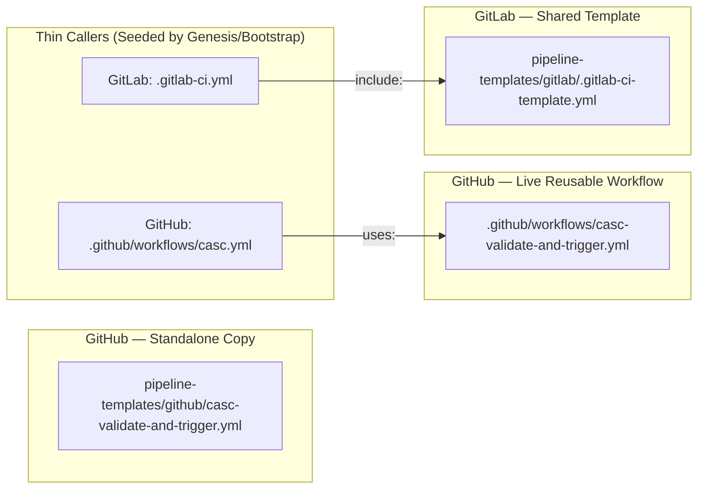

# aap-casc-engine

Hybrid AAP Configuration-as-Code engine combining **JSON-as-Interface** for tenant self-service with **`infra.aap_configuration`** as the platform backend. A reusable Red Hat Professional Services offering for governed, multi-tenant AAP management at enterprise scale.

## Overview

The `aap-casc-engine` is the core deliverable of the **Hybrid AAP Configuration-as-Code Framework**. It provides:

- **Dispatcher playbook** — Clones CasC repos from Git, processes JSON (env filter, merge, scope suffix), and applies configuration to AAP via the `infra.aap_configuration.dispatch` role
- **Drift detection** — Compares Git desired state vs AAP live state, generates drift reports (persisted as AAP job artifacts via `set_stats`), and optionally auto-remediates
- **Platform genesis** — Automated one-time setup of all platform CasC repos, CI/CD seeding, and manifest push to the manifest repo
- **Bootstrap automation** — Automated tenant onboarding (org creation, RBAC, repo scaffolding)
- **Pipeline-as-a-Service** — Shared CI/CD templates (GitLab CI + GitHub Actions) for validation and deployment
- **JSON schema contracts** — Validation schemas for all AAP resource types
- **Governance policies** — OPA policies and naming convention enforcement

## Two-Persona Architecture

| Persona | Responsibility | Interface |
|---------|---------------|-----------|
| **Platform Team** | Manage engine, governance, shared resources, onboarding | This repo + platform CasC repos |
| **Tenant Teams** | Define their AAP resources (projects, credentials, templates, etc.) | Declarative JSON files — engine and collection complexity abstracted |

Tenant teams commit JSON files to their dedicated repos. The platform-managed pipeline validates and triggers the dispatcher, which applies configuration to AAP. Tenants never interact with the dispatch role, collection internals, or this engine directly — the JSON-as-Interface and pipeline-as-a-service abstract all of that.

## Repository Structure

```
aap-casc-engine/
├── site.yml                          # Dispatcher playbook (main entry point)
├── drift-detect.yml                  # Drift detection playbook
├── remediate.yml                     # Drift remediation tasks
├── genesis.yml                       # Platform genesis playbook
├── bootstrap.yml                     # Tenant onboarding playbook
├── repos-manifest.yml                # Default template (pushed to manifest repo by genesis)
├── ansible.cfg                       # Ansible configuration
├── inventory/
│   ├── dev.yml                       # Dev AAP environment
│   ├── tst.yml                       # Test AAP environment
│   ├── npr.yml                       # Pre-production AAP environment
│   └── prd.yml                       # Production AAP environment
├── roles/
│   ├── git_clone_repos/              # Clone CasC repos from Git
│   └── process_casc_json/            # Env filter + merge + scope suffix
├── schemas/
│   ├── *.schema.json                 # JSON Schema contracts per resource type
│   ├── validate_naming.py            # Naming convention validator
│   ├── naming-rules.yml              # Naming convention rules
│   └── policies/                     # OPA governance policies
├── pipeline-templates/
│   ├── gitlab/                       # GitLab CI shared template
│   └── github/                       # GitHub Actions reusable workflow
├── templates/                        # Jinja2 templates for bootstrap
├── collections/
│   └── requirements.yml              # Ansible collection dependencies
├── execution-environment/
│   └── execution-environment.yml     # EE build definition
└── examples/
    ├── platform/                     # Example platform JSON configs
    └── tenant/                       # Example tenant JSON configs
```

## Quick Start

### Prerequisites

- **AAP 2.5+** with Gateway, Controller, Hub, and (optionally) EDA
- **Git SCM** (GitLab, GitHub, or compatible) with API access
- **CI/CD platform** (GitLab CI, GitHub Actions, or compatible)
- **`infra.aap_configuration`** collection v4.x (>=4.0.0, <5.0.0) installed in the Execution Environment
- **Galaxy server** configured in AAP for Red Hat Certified collection dependencies (e.g., `ansible.platform`). Options: Red Hat Automation Hub (`console.redhat.com`), Private Automation Hub bundled with AAP, or a customer-managed Galaxy repository. The Galaxy credential must be attached to the organization that owns the engine project.
- Python 3.9+ (for local validation)

### 1. Review the Manifest Defaults

`repos-manifest.yml` in this engine repo provides **production-ready defaults** for all CasC repository definitions. Customers do **not** edit this file — the engine fork stays immutable for clean upstream pulls. Day-0 overrides are provided via the genesis JT extra_vars (or survey for simple string fields like `default_organization`):

| Field | Default | How to override |
|-------|---------|-----------------|
| `default_organization` | `Default` | Genesis JT extra_var or survey |
| `env_branch_map` | GitFlow (see below) | Genesis JT extra_var (YAML) |
| `platform_repos` | 9 standard repos | Rarely changed; edit manifest repo post-genesis if needed |
| `tenant_repos` | `[]` | Added automatically by bootstrap |

**Default `env_branch_map` (GitFlow):**

| Environment | Branch |
|-------------|--------|
| dev | develop |
| tst | develop |
| npr | release/npr |
| prd | main |

**Common override patterns (via genesis JT extra_vars):**

| Strategy | YAML value |
|----------|------------|
| Single branch (demo) | `{dev: main, tst: main, npr: main, prd: main}` |
| Environment branches | `{dev: env/dev, tst: env/tst, npr: env/npr, prd: main}` |
| Trunk-based (with tags) | `{dev: main, tst: main, npr: main, prd: main}` |

Genesis merges overrides with the defaults and pushes the result to the manifest repo. After genesis, the manifest repo's copy is the operational single source of truth. The dispatcher, drift-detect, and bootstrap load it at runtime.

**Naming conventions:**

The engine enforces several naming conventions across repositories, JSON config files, and AAP resources:

**Repository naming:**

| Scope | Pattern | Example |
|-------|---------|---------|
| Platform (global governance) | `<casc_key>-global` | `aap-organizations-global`, `controller-settings-global` |
| Platform (schedules) | `controller-schedules-platform` | `controller-schedules-platform` |
| Tenant (org-scoped) | `controller-<type>-<org_id>` | `controller-templates-demo_alpha` |

The `-global` suffix means **"platform-managed"** (governance scope), not "no org association in AAP." Some platform-managed resources are truly global in AAP (e.g., `controller_settings`, `controller_credential_types`), while others reference organizations but are managed centrally by the platform team (e.g., `aap_organizations`, `aap_teams`, RBAC assignments). Execution environments (`controller_execution_environments`) have an optional `organization` field — when omitted, they're available to all orgs, which is the typical platform-managed pattern.

Org-scoped resources that tenants manage directly — projects, credentials, inventories, templates, workflows, schedules, and notifications — live in per-tenant repos (`controller-<type>-<org_id>`) created by the bootstrap playbook.

**JSON config file naming — environment-specific imports:**

Files are included or excluded based on the `target_env` variable (set in the dispatcher/drift-detect JT) and the **env-to-branch mapping** defined in `repos-manifest.yml`. The engine checks each filename for an environment suffix:

| Filename pattern | Included when `target_env` is | Description |
|------------------|-------------------------------|-------------|
| `resource-name.json` | Any environment | Universal — always included |
| `resource-name-dev.json` | `dev` only | Development-specific config |
| `resource-name-tst.json` | `tst` only | Test-specific config |
| `resource-name-npr.json` | `npr` only | Pre-production-specific config |
| `resource-name-prd.json` | `prd` only | Production-specific config |

> **Warning — accidental env-suffix matching:** The engine uses a regex (`-(dev|tst|npr|prd)$` before `.json`) to detect environment-specific files. Any filename ending in `-dev`, `-tst`, `-npr`, or `-prd` (before `.json`) is treated as environment-specific and will be **excluded** when the dispatcher runs for a different environment. For example, a file named `inv-dev.json` would only be included when `target_env=dev` — if this inventory is intended for all environments, name it `inv-development.json` or `inv-alpha-dev-servers.json` instead. Similarly, `crd-prod.json` would not match `prd` (the suffix must be exactly `-prd`), but `crd-prd.json` would.

**AAP resource naming prefixes (Naming Standard v1):**

| Resource type | Prefix | Example |
|---------------|--------|---------|
| Organizations | `org-` | `org-demo_alpha` |
| Projects | `prj-` | `prj-demo_alpha-hello_world` |
| Credentials | `crd-` | `crd-demo_alpha-machine_demo` |
| Credential Types | `ctp-` | `ctp-database_credentials` |
| Inventories | `inv-` | `inv-demo_alpha-hello_world-dev` |
| Job Templates | `jt-` | `jt-demo_alpha-hello_world` |
| Workflows | `wfjt-` | `wfjt-demo_alpha-deploy_pipeline` |
| Schedules | `sch-` | `sch-demo_alpha-nightly_hello` |
| Notifications | `ntf-` | `ntf-demo_alpha-slack_alerts` |
| Execution Environments | `ee-` | `ee-rhel9-ansible218-base` |

### 2. Run Platform Genesis

Run the genesis playbook to create all platform CasC repos automatically:

```bash
export SCM_TOKEN="<your-scm-token>"
ansible-playbook genesis.yml \
  -e platform_scm_org=<your-platform-org> \
  -e scm_base_url=https://github.com \
  -e engine_repo=aap-casc-engine \
  -e default_organization=MyOrg \
  -e '{"env_branch_map": {"dev": "main", "tst": "main", "npr": "main", "prd": "main"}}'
```

Genesis reads the default `repos-manifest.yml` from this engine repo, merges any JT overrides (`default_organization`, `env_branch_map`), and:
1. Creates all platform repos listed in `platform_repos` (idempotent — tolerates already-existing repos)
2. Pushes the merged manifest to the manifest repo (default: `aap-organizations-global`, override via `MANIFEST_REPO` env var) on first run only — reruns skip this to preserve `tenant_repos` entries added by bootstrap
3. Seeds CI/CD thin callers and READMEs in each repo

**Via AAP Job Template:** Create `jt-platform-genesis` with playbook `genesis.yml`, attach `crd-platform-scm_token`, and set extra vars for `scm_base_url`, `platform_scm_org`, `engine_repo`, and `default_organization`. Optionally add `env_branch_map` as an extra_var to override the GitFlow default. No AAP connection credential is needed — genesis only interacts with the SCM API.

### Post-Genesis Manifest Changes

After genesis pushes the manifest to the manifest repo, subsequent changes to the manifest (e.g., new branch mappings, additional platform repos) should be made directly in the manifest repo's copy (`<manifest-repo>/repos-manifest.yml` — default: `aap-organizations-global`). The engine's local copy provides defaults only and should not be edited.

### 3. Configure Connection

**Via AAP Job Templates (production):** AAP credentials inject `CONTROLLER_HOST`, `CONTROLLER_USERNAME`, `CONTROLLER_PASSWORD`, and `SCM_TOKEN` automatically. No manual configuration needed -- see [AAP Credential Types](#aap-credential-types) below.

**Via CLI (local testing):** Set environment variables directly. The playbooks read these from play-level `vars:`, which take precedence over inventory files:

```bash
export CONTROLLER_HOST="aap-controller.dev.example.com"
export CONTROLLER_USERNAME="admin"
export CONTROLLER_PASSWORD="<your-password>"
export SCM_BASE_URL="https://gitlab.example.com/casc"
export SCM_TOKEN="<your-scm-token>"
```

> **Inventory files:** `inventory/{dev,tst,npr,prd}.yml` set `target_env` and provide per-environment host fallbacks (`CONTROLLER_DEV_HOST`, etc.) for advanced multi-env CLI workflows. Note that playbook play-level `vars:` have higher Ansible precedence than inventory group vars, so `CONTROLLER_HOST` from the environment (read by play vars) is used unless overridden with `-e`.

### 4. Run the Dispatcher

**Full apply** (all repos — scheduled reconciliation):

```bash
ansible-playbook site.yml -e target_env=dev
```

**Targeted apply** (single tenant + platform repos — CI/CD triggered):

```bash
ansible-playbook site.yml \
  -e target_env=dev \
  -e triggered_repo=controller-projects-myorg01 \
  -e trigger_source=ci-cd-pipeline
```

### 5. Run Drift Detection

```bash
# Report mode (detect only)
ansible-playbook drift-detect.yml -e target_env=dev -e drift_mode=report

# Remediate mode (detect and auto-fix)
ansible-playbook drift-detect.yml -e target_env=prd -e drift_mode=remediate
```

The drift report is published as an **AAP job artifact** via `set_stats`. Each job run stores its own report in the AAP database — retrievable from the job details page in the UI or via the API at `/api/controller/v2/jobs/<id>/` in the `artifacts` field. Reports are never overwritten; each run creates a new job record with its own artifact, providing a full audit history. A human-readable summary is also printed to the job stdout.

**Understanding "extra in live" drift:** The drift report will show "extra in live" items for platform-managed resources that exist in AAP but are not defined in the CasC config repos — such as the engine project (`prj-platform-casc_engine`), platform job templates (`jt-platform-*`), custom credential types (`CasC SCM Token`), and AAP built-in defaults (`Demo Project`). This is **expected and by design**. The dispatcher is additive/convergent — it creates and updates resources from Git but never deletes resources from AAP that are absent from Git. Investigate "extra in live" items that don't follow known naming patterns, as they may indicate unauthorized manual changes.

### 6. Bootstrap a New Tenant

```bash
ansible-playbook bootstrap.yml \
  -e org_id=newteam01 \
  -e team_name="New Team" \
  -e team_lead=newteam_lead \
  -e team_group=newteam_developers
```

## How It Works

1. **Tenant teams** commit flat JSON files (e.g., `controller_projects`, `controller_credentials`) to their dedicated Git repos using standard `infra.aap_configuration` variable names
2. **The shared CI/CD pipeline** validates JSON files (schema, naming, policy) and triggers the dispatcher on the correct AAP environment via a single API call
3. **The dispatcher** (`site.yml`) clones all CasC repos from Git, filters by environment, merges JSON files, adds scope suffixes (`_platform`, `_<org_id>`), and applies via `infra.aap_configuration.dispatch` with `dispatch_include_wildcard_vars: true`
4. **Weekly scheduled reconciliation** runs drift detection to catch manual changes and ensure continuous compliance

## Key Design Principles

- **JSON-as-Interface** — All AAP resources are defined as flat JSON files with standard variable names. The engine and `infra.aap_configuration` collection complexity is fully abstracted from tenant teams.
- **Scope suffixing** — The `process_casc_json` role adds suffixes (e.g., `controller_projects_myorg01`). The `dispatch` role's wildcard merging combines them automatically.
- **Dual-mode apply** — Targeted apply for CI/CD triggers (fast, single tenant); full apply for scheduled reconciliation (comprehensive).
- **Git as single source of truth** — No artifact repositories. The dispatcher clones repos directly from Git.
- **Vault-free secrets** — AAP Custom Credential Types with external secrets manager integration (HashiCorp Vault, CyberArk, Azure Key Vault).

## CI/CD Pipeline Setup

### CI/CD Architecture

The engine ships three CI/CD pipeline implementations:



- **Live reusable workflow** (`.github/workflows/`) — primary GitHub implementation; thin callers reference via `uses:`.
- **Standalone GitHub copy** (`pipeline-templates/github/`) — for environments that cannot use reusable workflows. Copy into the repo and set `vars.ENGINE_REPO`.
- **GitLab shared template** (`pipeline-templates/gitlab/`) — for GitLab environments; thin callers reference via `include:`.

All three have feature parity: 4-stage validation, dual authentication, three-layer concurrency/serialization, manual trigger support, and branch-to-environment routing.

### GitLab CI

Tenant repos include the shared pipeline template:

```yaml
# .gitlab-ci.yml in tenant repo
include:
  - project: '<platform-group>/aap-casc-engine'
    ref: 'main'
    file: '/pipeline-templates/gitlab/.gitlab-ci-template.yml'
```

> **Note:** Replace `<platform-group>` with the full path to the engine project in your GitLab instance. Set `ENGINE_PROJECT_PATH` as a **group-level CI/CD variable** (e.g., `my-platform-group/aap-casc-engine`). The pipeline fails fast with a clear error if this variable is empty. If tenant repos are in a different GitLab group, add them to the engine project's CI/CD Token Access allowlist (Settings > CI/CD > Token Access) so `CI_JOB_TOKEN` can authenticate the schema fetch.

### GitHub Actions

Tenant repos reference the reusable workflow:

```yaml
# .github/workflows/casc.yml in tenant repo
name: CasC Pipeline
on:
  push:
  pull_request:
    branches: [main]
  workflow_dispatch:
jobs:
  casc:
    uses: <org>/aap-casc-engine/.github/workflows/casc-validate-and-trigger.yml@main
    with:
      dispatcher_jt_name: jt-platform-casc_dispatcher
    secrets: inherit
```

The `workflow_dispatch` event enables manual pipeline runs from the GitHub Actions tab or via `gh workflow run`.

**Concurrency and serialization:** Within each repo, the trigger job uses `concurrency: { group: casc-dispatcher-trigger, cancel-in-progress: false }` to queue rapid successive pushes (GitLab equivalent: `resource_group: casc-dispatcher`). Across repos, the trigger script polls the AAP API for running/pending/waiting dispatcher jobs and waits up to 3 minutes before launching — this AAP-level busy-wait is the primary cross-repo serialization mechanism. The dispatcher JT must have `allow_simultaneous` set to **false** (the default) as the ultimate safety net — the pipeline verifies this at runtime and fails immediately if misconfigured. Even if two pipelines pass the busy-wait simultaneously, AAP queues the second launch.

The workflow supports **dual authentication**:

- **Bearer token** (production) — per-environment secrets with branch-to-env routing
- **Basic auth** (demo/sandbox) — single-host secrets for quick validation setups

If per-env token secrets are set, Bearer token auth with branch routing is used. Otherwise, if `AAP_HOST` + `AAP_USERNAME` + `AAP_PASSWORD` are set, basic auth against a single AAP host is used. If neither is configured, the trigger stage is skipped (validate-only mode).

### Required CI/CD Variables

**Production mode (Bearer token — per-environment):**

| Variable | Description |
|----------|-------------|
| `AAP_DEV_HOST` / `AAP_TST_HOST` / `AAP_NPR_HOST` / `AAP_PRD_HOST` | AAP API endpoints per environment |
| `AAP_DEV_TOKEN` / `AAP_TST_TOKEN` / `AAP_NPR_TOKEN` / `AAP_PRD_TOKEN` | Per-environment AAP API tokens |

**Demo/sandbox mode (basic auth — single host):**

| Variable | Description |
|----------|-------------|
| `AAP_HOST` | AAP controller hostname |
| `AAP_USERNAME` | AAP username (least-privilege: execute-only on dispatcher JT) |
| `AAP_PASSWORD` | AAP password |

**Workflow inputs:**

| Input | Default | Description |
|-------|---------|-------------|
| `dispatcher_jt_name` | `jt-platform-casc_dispatcher` | Name of the dispatcher Job Template to trigger |

**Optional secrets:**

| Secret | Description |
|--------|-------------|
| `ENGINE_REPO_TOKEN` | GitHub PAT for accessing the engine repo when it is private (defaults to `github.token` for public repos) |

**Environment promotion:** The pipeline validates and triggers the dispatcher — it does not auto-create promotion PRs/MRs between branches. Promotion (e.g., `develop` → `release/npr` → `main`) is a manual step through your standard change management workflow. Organizations that want auto-promotion can add a `promote` job to their thin caller (not to this reusable workflow). See the platform-team-user-guide for patterns and examples.

## AAP Job Templates

Create these Job Templates in each AAP environment:

| Job Template | Playbook | Purpose |
|-------------|----------|---------|
| `jt-platform-genesis` | `genesis.yml` | One-time platform repo creation (SCM only) |
| `jt-platform-casc_dispatcher` | `site.yml` | Main dispatcher — apply CasC configuration |
| `jt-platform-drift_detection` | `drift-detect.yml` | Drift detection and reconciliation |
| `jt-platform-bootstrap_tenant` | `bootstrap.yml` | Onboard new tenant organizations |

## AAP Credential Types

All sensitive connection values are injected at runtime via AAP credentials attached to Job Templates. Playbooks read exclusively from environment variables -- no plaintext secrets in `extra_vars`.

### Built-in: Red Hat Ansible Automation Platform

Injects `CONTROLLER_HOST`, `CONTROLLER_USERNAME`, `CONTROLLER_PASSWORD`, `CONTROLLER_VERIFY_SSL` as environment variables. The dispatcher, drift-detect, and bootstrap playbooks read these via `lookup('env', ...)`.

- Credential name (demo): `crd-platform-aap_connection`
- Attach to dispatcher, drift-detection, and bootstrap JTs (not genesis — genesis only uses SCM)

### Custom: CasC SCM Token

The built-in GitHub/GitLab PAT credential types have empty injectors -- they cannot pass tokens to playbooks. Create a custom credential type:

- **Name:** `CasC SCM Token`
- **Input:** `scm_token` (secret string)
- **Injector:** `env: { SCM_TOKEN: "{{ '{{' }}scm_token{{ '}}' }}" }`

Both `scm_token` (git clone) and `scm_api_token` (bootstrap/genesis SCM API) resolve from the single `SCM_TOKEN` environment variable.

- Credential name (demo): `crd-platform-scm_token`
- Attach to all 4 Job Templates (genesis, dispatcher, drift-detection, bootstrap)

### What Stays in extra_vars

Non-sensitive configuration values remain in JT `extra_vars`:
- `target_env`, `scm_base_url`, `manifest_repo`, `platform_scm_org`, `orgs_repo`, etc.

## SCM Token Requirements

The `SCM_TOKEN` credential should belong to a **dedicated service account** (machine user), not a personal user. Required permissions:

| Playbook | Access Needed |
|----------|--------------|
| `genesis.yml` | **Read-write** in the platform SCM org (repo creation + file writes) |
| `site.yml` (dispatcher) | **Read** across all CasC repos (platform + tenant orgs) |
| `drift-detect.yml` | **Read** across all CasC repos (platform + tenant orgs) |
| `bootstrap.yml` | **Read-write** in the target tenant SCM org + platform manifest repo |

A single token with broad access is the simplest model but has a wider blast radius if compromised. For production hardening options (GitHub App, per-org credentials, fine-grained PATs, GitLab Group Access Tokens), see the master design document.

## Tenant Onboarding Workflow

Bootstrap follows a 4-phase handshake between the platform and tenant teams:

1. **Intake** -- Tenant provides `org_id`, `team_name`, `team_lead`, `tenant_scm_org`, preferred `repo_pattern`
2. **SCM + CI/CD prerequisite** -- Platform team adds service account to tenant's SCM org and configures CI/CD secrets
3. **Bootstrap execution** -- Platform team runs `jt-platform-bootstrap_tenant` with tenant survey inputs
4. **Handover** -- Platform team provides tenant with repo URLs, pipeline usage guide, and first-action path

See the platform team user guide for a detailed checklist.

## CI/CD Secret Requirements

The CI/CD pipeline trigger stage authenticates with AAP using secrets stored in the CI/CD platform. These are separate from AAP credential types.

**GitHub Actions** (per tenant org):

| Secret | Required | Description |
|--------|----------|-------------|
| `AAP_HOST` | Basic auth | AAP controller hostname |
| `AAP_USERNAME` | Basic auth | AAP username with execute permission on dispatcher JT |
| `AAP_PASSWORD` | Basic auth | AAP password |
| `AAP_DEV_HOST` / `AAP_DEV_TOKEN` | Bearer auth | Per-environment AAP endpoints and OAuth tokens |
| `ENGINE_REPO_TOKEN` | If engine is private | PAT with read access to the engine repo |

**GitLab CI** (per tenant group):

| Variable | Required | Description |
|----------|----------|-------------|
| `AAP_HOST` | Basic auth | AAP controller hostname |
| `AAP_USERNAME` | Basic auth | AAP username |
| `AAP_PASSWORD` | Basic auth | AAP password |
| Engine `CI_JOB_TOKEN` allowlist | Always | Add tenant groups to the engine project's Token Access settings |

The AAP user/token used by CI/CD should have **only Execute permission** on the dispatcher JT. Rotate tokens on a schedule and enable AAP activity stream monitoring.

## Runtime Prerequisites

Before pipelines will function correctly, verify these conditions outside the templates:

| Category | Prerequisite | GitHub Actions | GitLab CI |
|----------|-------------|----------------|-----------|
| **Engine access** | Pipeline can fetch schemas from this repo | `ENGINE_REPO_TOKEN` org secret (PAT with read access) if private; `github.token` for public | Add tenant projects/groups to engine project's **CI/CD Token Access allowlist** |
| **Engine path** | Pipeline knows where the engine repo lives | Auto-resolved from caller's `uses:` directive | Set `ENGINE_PROJECT_PATH` as group-level CI/CD variable |
| **AAP credentials** | Pipeline can authenticate to AAP API | Org-level secrets: Bearer tokens or basic auth | Group-level CI/CD variables: same choices |
| **Dispatcher JT** | `jt-platform-casc_dispatcher` exists, `allow_simultaneous` = false | Pipeline verifies at runtime; fails if misconfigured | Same AAP API checks |
| **AAP API reachability** | CI/CD runners can reach AAP over HTTPS | Runner network allows outbound HTTPS | Same requirement |

## Event-Path Testing

After setup, verify each event path works:

| Event | How to test | Expected behavior |
|-------|------------|-------------------|
| **Push** | Push a JSON change to `main` | Validation passes, trigger launches dispatcher, AAP job succeeds |
| **PR / MR** | Open a PR/MR to `main` | Validation runs; trigger stage is **skipped** |
| **Manual** | GitHub: Actions tab > "Run workflow" (both stages run automatically); GitLab: CI/CD > "Run pipeline" (validation runs automatically; trigger job requires an additional manual click) | Validation passes; dispatcher launches in FULL mode |
| **Branch routing** | Push to `feature/*`, `develop`, `release/*` | Correct `TARGET_ENV` selected (dev/tst/npr/prd) |

## Local Validation

Validate JSON files locally before committing:

```bash
# Install validation tools
pip install check-jsonschema pyyaml

# Validate a JSON file against its schema
resource_type=$(python3 -c "import json,sys; print(list(json.load(open(sys.argv[1])).keys())[0])" your-file.json)
check-jsonschema --schemafile schemas/${resource_type}.schema.json your-file.json

# Validate naming conventions
python3 schemas/validate_naming.py --config-dir . --rules schemas/naming-rules.yml
```

## Dependencies

- [infra.aap_configuration](https://github.com/redhat-cop/infra.aap_configuration) >= 4.0.0, < 5.0.0 — Red Hat Communities of Practice collection for AAP management (wildcard variable merge in dispatch)
- Red Hat Ansible Automation Platform 2.5+
- Python 3.9+

## License

[GPL-3.0](LICENSE) — consistent with `infra.aap_configuration` and other Red Hat Communities of Practice Ansible projects.

## Contributing

This project is part of the [Red Hat Communities of Practice](https://github.com/redhat-cop). Contributions are welcome via pull requests.

## Related Resources

- [infra.aap_configuration documentation](https://github.com/redhat-cop/infra.aap_configuration)
- [Ansible Automation Platform documentation](https://docs.redhat.com/en/documentation/red_hat_ansible_automation_platform/)
- [Red Hat Communities of Practice](https://github.com/redhat-cop)
