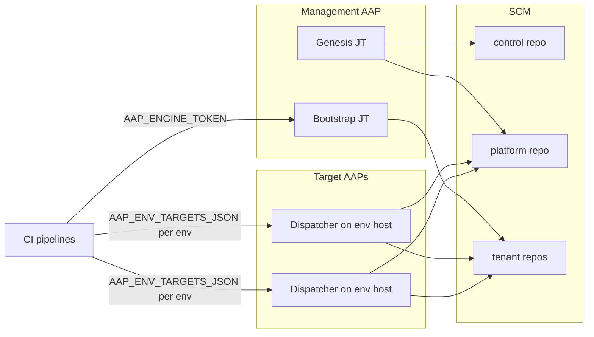

# AAP Multi-Tenant CasC Engine — Setup and Operations Guide

Canonical guide for installing, configuring, validating, and operating the
engine. Progressive disclosure:

| Part | Use when |
|---|---|
| **A** | Shortest supported setup (topology, AAP construction, secrets, first run) |
| **B** | Field-level configuration reference |
| **C** | Adoption, security, day-2 recovery |
| **D** | Validation status, limitations, troubleshooting |

OIDC federation and external secret managers are out of scope. The baseline uses
provider-native protected secrets/variables and AAP Job Template credentials.

Satellite documents (linked, not duplicated):

- [Pipeline Trigger Logic](pipeline-trigger-logic.md)
- [Nonproduction Validation](NONPRODUCTION_VALIDATION.md)
- [Resource Deletion Capabilities](resource-deletion-capabilities.md)

### Validation status

| Provider / path | Status |
|---|---|
| GitHub Actions + AAP (combined-only contract) | Live-validated for the current engine contract |
| GitLab CI | **Static / template parity only** — do not treat as live-validated |

### Security baseline

Production launcher identities must have **Execute only** on the intended Job
Template (Bootstrap-only and Dispatcher-only). Unrelated Job Template launch on
the same host must be rejected (HTTP 403). Superuser or broad Organization Admin
launchers are not production guidance.

### Naming convention for inputs

| Channel | Name style | Examples |
|---|---|---|
| JT Variables / survey / API `extra_vars` | **lowercase** Ansible vars | `control_repo`, `target_env`, `tenant_id`, `control_revision` |
| Credential-injected environment | **UPPERCASE** | `SCM_TOKEN`, `CONTROLLER_HOST`, `CONTROLLER_PASSWORD` |
| GitHub Actions secrets / vars | documented names | `CONTROL_REPO_TOKEN`, `AAP_ENGINE_HOST` |
| GitLab CI/CD variables | documented names | `CONTROL_REPO_TOKEN`, `ENGINE_PROJECT_PATH`, `CASC_CALLER_ROLE` |

Playbooks often default from `lookup('env', 'UPPERCASE')` when the lowercase
Ansible variable is unset. **Configure Job Templates and surveys with
lowercase names.** Copying uppercase names into JT Variables or surveys can
result in ignored values. CI launches already send lowercase `extra_vars`
(`target_env`, `tenant_id`, `control_revision`, and so on).

### Prerequisites (tested baseline)

Label: **current installation prerequisite / tested baseline**, not a formal
support matrix. The formal compatibility and upgrade contract remains
**ROADMAP-008**.

| Prerequisite | Baseline |
|---|---|
| Collection | `infra.aap_configuration >=4.0.0,<5.0.0` ([`collections/requirements.yml`](../collections/requirements.yml)) |
| Execution environment | EE image that **already contains** that collection and its certified transitive dependencies (jobs do not install the collection at runtime) |
| AAP API | Management AAP for Genesis/Bootstrap; each target AAP listed in `AAP_ENV_TARGETS_JSON` for Dispatcher |
| SCM API | GitHub or GitLab token suitable for the chosen Genesis/Bootstrap `repo_mode` |
| Pipelines | Protected secrets/variables per provider and caller role (Part A secrets) |

### Authentication contracts (do not conflate)

| Path | Contract |
|---|---|
| CI launcher → AAP API | Bearer token only (`AAP_ENGINE_TOKEN`, tokens inside `AAP_ENV_TARGETS_JSON`) |
| Dispatcher apply (`site.yml`) | Username/password via `CONTROLLER_HOST`, `CONTROLLER_USERNAME`, `CONTROLLER_PASSWORD`, `CONTROLLER_VERIFY_SSL` |
| Drift compare (`drift-detect.yml`) | `CONTROLLER_OAUTH_TOKEN` preferred when set; otherwise username/password |

---

## Part A — Shortest supported setup

### A0. Multi-AAP deployment topology

CI resolves each `env_branch_map` key against `AAP_ENV_TARGETS_JSON` and launches
the Dispatcher Job Template **on that environment’s AAP host**. Do not assume a
single AAP host holds every Job Template for every environment.

| Location | Required resources |
|---|---|
| **Management / engine AAP** | Engine Project; Genesis JT; Bootstrap JT; inventory + EE; SCM **write** credential (injects `SCM_TOKEN`); Bootstrap-only execute launcher identity + token (`AAP_ENGINE_TOKEN`) |
| **Each target AAP** (every host in `AAP_ENV_TARGETS_JSON`) | Engine (or Dispatcher) Project; Dispatcher JT; inventory + EE; SCM **read** credential (`SCM_TOKEN`); target AAP connection credential (`CONTROLLER_HOST` / username / password); Dispatcher-only execute launcher token for that host |
| **Drift** | AAP JT only — **not** CI-launched. See placements below |



#### Drift placements (supported vs validated)

Drift is never launched by the validate/bootstrap/trigger/fanout pipelines.
Operators schedule or launch `drift-detect.yml` from AAP.

| Placement | Meaning | Status |
|---|---|---|
| **A — Management AAP** | Drift JT on management/engine AAP; attached Controller credential targets the AAP under comparison; SCM read reaches control + desired state | **Supported** by the playbook env contract |
| **B — Target AAP** | Drift JT on the target AAP; local Controller credential + SCM read | **Supported** by the playbook env contract |

Neither placement is documented here as a separately validated multi-AAP
architecture baseline. Choose a placement where attached credentials satisfy the
Drift env contract. Validated nonproduction coverage for Drift is report-mode
behavior and deletion-safety interaction (see
[Nonproduction Validation](NONPRODUCTION_VALIDATION.md)), not a mandated host
topology.

### A1. Canonical AAP resource construction

Names below are **defaults**. Persist customer names in control `config.yml`
`job_templates.*` and matching Genesis lowercase inputs
(`genesis_jt_name`, and so on).

Place the Project, credentials, inventory, EE reference, and Job Templates in
the **same AAP Organization** (commonly `Default` or a dedicated platform
organization).

#### Project

| Setting | Guidance |
|---|---|
| Organization | Same org as JTs and credentials |
| Name (example) | `prj-platform-casc_engine` |
| SCM URL | Customer fork or copy of `aap-casc-engine` |
| Branch | Branch operators sync for JT playbooks |
| SCM credential | Built-in **Source Control** credential for project sync only (not CasC `SCM_TOKEN`) |
| Update on launch | Recommended so JT runs use the intended engine revision |
| Collections | Provided by the attached EE (see below), not installed by the job from this guide’s baseline |

#### Inventory

| Setting | Guidance |
|---|---|
| Name (example) | `inv-platform-casc_localhost` |
| Host | `localhost` |
| Host/group vars | Prefer playbook `connection: local` (all engine playbooks use `hosts: localhost` / `connection: local`) |
| Attachment | Assign this inventory to Genesis, Bootstrap, Dispatcher, and Drift JTs |

#### Execution environment

Attach an EE that **already contains** Ansible plus
`infra.aap_configuration >=4.0.0,<5.0.0` (and certified transitive deps from
Automation Hub). Do not rely on the JT to install collections during the job for
this baseline. Assign the same EE to Genesis, Bootstrap, Dispatcher, and Drift.

#### Credential type: CasC SCM Token (exact)

Create **Administration → Credential Types → Add**:

**Name:** `CasC SCM Token`

**Input configuration:**

```yaml
fields:
  - id: scm_token
    label: SCM Token
    type: string
    secret: true
    help_text: Personal Access Token (or service account token) for SCM operations
required:
  - scm_token
```

**Injector configuration:**

```yaml
env:
  SCM_TOKEN: "{{ scm_token }}"
```

Create **separate credential instances** of that type (same injector schema,
different SCM tokens / scopes):

| Credential instance (examples) | Token scope | Attach to |
|---|---|---|
| `crd-platform-scm_token_write` | Create/update repos, push scaffold/foundation | Genesis, Bootstrap (management AAP) |
| `crd-platform-scm_token_read` | Read/clone control + desired-state repos only | Dispatcher, Drift (each target / Drift host) |

Do not reuse one write-capable SCM credential on Dispatcher/Drift.

Built-in GitHub/GitLab PAT types are for Project SCM sync and do **not** satisfy
the CasC `SCM_TOKEN` env contract.

#### Controller connection credentials

| Role | Type | Must inject | Attach to |
|---|---|---|---|
| Dispatcher apply | Built-in **Red Hat Ansible Automation Platform**, or custom injectors matching the contract | `CONTROLLER_HOST`, `CONTROLLER_USERNAME`, `CONTROLLER_PASSWORD`, `CONTROLLER_VERIFY_SSL` | Dispatcher JT on **that** target host |
| Drift **report** | Same family | Same as Dispatcher, plus optional `CONTROLLER_OAUTH_TOKEN` (preferred when set). Token/user needs **read** of compared resources | Drift JT (`drift_mode=report`) |
| Drift **remediate** | Same family | Same injectors, but identity must have **apply/write** rights — remediation invokes `infra.aap_configuration.dispatch` | Drift JT when `drift_mode=remediate` is used |
| Project sync | Built-in Source Control | Used only for Project update | Engine Project |

#### Job Templates — construction matrix

For each JT: Organization (same as Project), Inventory (localhost inventory),
Project (engine), Playbook, EE, Credentials, Variables (YAML), Survey,
`ask_variables_on_launch`, `allow_simultaneous`.

| JT (default name) | Playbook | Inventory | EE | Credentials | `allow_simultaneous` | `ask_variables_on_launch` | Survey |
|---|---|---|---|---|---|---|---|
| `jt-platform-genesis` | `genesis.yml` | localhost inventory | collection-bearing EE | SCM **write** credential | n/a | `false` when day-0 values are fixed Variables; optional survey if operators prompt selected day-0 fields | Optional |
| `jt-platform-bootstrap_tenant` | `bootstrap.yml` | localhost inventory | collection-bearing EE | SCM **write** credential | n/a | **`false`** | **Enabled** — API `extra_vars` allowlist (see below) |
| `jt-platform-casc_dispatcher` | `site.yml` | localhost inventory | collection-bearing EE | SCM **read** + Controller username/password | **`false` (required)** | **`false`** | **Enabled** — API `extra_vars` allowlist (see below) |
| `jt-platform-drift_detection` | `drift-detect.yml` | localhost inventory | collection-bearing EE | SCM **read** + Controller (OAuth preferred; write-capable if remediating) | operator choice | `false` | Optional survey allowlist for `target_env`, `drift_mode`, `control_revision` |

**AAP launch-variable rule (deployment-blocking):** With
`ask_variables_on_launch=false`, Automation Controller accepts API `extra_vars`
only for keys that exist on an **enabled survey**. Keys not in the survey are
ignored. Preferred baseline: keep `ask_variables_on_launch=false` and use
surveys as the explicit API-variable allowlist for Bootstrap and Dispatcher.
Arbitrary API `extra_vars` are **not** accepted unless each key is on the
enabled survey (when `ask_variables_on_launch=false`). Do **not** put
trust-boundary control coordinates (`control_scm_org`, `control_repo`,
`control_branch`) in surveys.

##### Genesis — fixed Variables example (lowercase)

```yaml
---
scm_base_url: https://github.com
platform_scm_org: example-platform
control_scm_org: example-platform
control_repo: casc-platform-control
control_branch: main
engine_repo: aap-casc-engine
platform_repo: casc-platform-global
repo_mode: create
repo_visibility: private
create_missing_env_branches: true
bootstrap_dispatch_fanout: true
env_branch_map:
  dev: develop
  tst: release/tst
  prd: main
```

Launch-time overrides (still lowercase): `repo_mode`, `env_branch_map`, GitLab
`platform_namespace_id` / `control_namespace_id`, JT name overrides
(`genesis_jt_name`, `bootstrap_jt_name`, `dispatcher_jt_name`,
`drift_detection_jt_name`).

Use `repo_mode=existing` only when governance pre-creates repositories (see A4).

##### Bootstrap — fixed Variables (trust boundary, lowercase, not survey)

```yaml
---
scm_base_url: https://github.com
control_scm_org: example-platform
control_repo: casc-platform-control
control_branch: main
platform_scm_org: example-platform
engine_repo: aap-casc-engine
```

##### Bootstrap — survey allowlist (lowercase; required for CI `extra_vars`)

Include **all** keys CI or operators may pass via API/UI. Survey-required
flags apply to **both UI and API** launches — Automation Controller rejects a
launch that omits a survey-required field. Conditional Greenfield/Brownfield
rules for `aap_organization` and `team_name` are enforced by the engine at
runtime, not by marking those fields survey-required.

| Survey variable | Survey required? | Runtime rule |
|---|---:|---|
| `tenant_id` | Yes | `^[a-z][a-z0-9_]*$`, max 64 |
| `onboarding_mode` | Yes | `greenfield` or `brownfield` |
| `tenant_scm_org` | Yes | Tenant SCM org/group; registered Git record is authoritative when present |
| `aap_organization` | No | Engine: Greenfield defaults to `tenant_id`; Brownfield requires it |
| `team_name` | No | Engine: Greenfield requires it; Brownfield rejects it |
| `repo_mode`, `repo_visibility` | No | Defaults apply when omitted |
| `repo_name` | No | Optional combined tenant repository override |
| `tenant_scm_namespace_id` | No | GitLab create mode when needed |
| `dispatch_enabled` | No | Optional override; empty uses registry/default |
| `control_revision` | No | CI pin when supplied; mismatch fails closed |

Do not configure team-lead, user-password, or SCM collaborator survey questions.
Do not survey `control_scm_org`, `control_repo`, or `control_branch`.

CI Bootstrap launches send a normalized API `extra_vars` payload built from the
tenant registry (always includes the survey-required identity fields plus
`aap_organization` and `control_revision`; optional keys only when set):

```json
{
  "tenant_id": "stores",
  "aap_organization": "Example Stores Automation",
  "tenant_scm_org": "example-tenants",
  "control_revision": "<sha>",
  "team_name": "Stores Automation",
  "repo_mode": "create",
  "onboarding_mode": "greenfield",
  "repo_name": "stores-aap-casc"
}
```

Every key in that payload must exist on the Bootstrap survey allowlist. For
registered tenants, Git registry values win over conflicting survey answers for
identity fields.

##### Dispatcher — fixed Variables (trust boundary, lowercase)

```yaml
---
scm_base_url: https://github.com
control_scm_org: example-platform
control_repo: casc-platform-control
control_branch: main
platform_scm_org: example-platform
```

##### Dispatcher — survey allowlist (lowercase; required for CI `extra_vars`)

| Survey variable | Survey required? | Notes |
|---|---:|---|
| `target_env` | Yes (UI) | Mapped environment name |
| `dispatch_scope` | No | `platform` \| `tenant` \| `full` |
| `tenant_id` | No | Tenant scope |
| `triggered_repo` | No | Full SCM path for repo→tenant mapping |
| `control_revision` | No | Pinned control SHA |
| `trigger_source` | No | For example `ci-cd-pipeline` |
| `trigger_commit` | No | Optional metadata |

CI supplies these as lowercase API `extra_vars`. Without this survey allowlist
(and with `ask_variables_on_launch=false`), they are ignored.

##### Drift — fixed Variables (lowercase) + optional survey allowlist

Same control-coordinate Variables pattern as Dispatcher. Survey (or prompts)
should allowlist `target_env`, `drift_mode` (`report` \| `remediate`), and
optional `control_revision` if launched via API with those keys.

#### Trust boundary — not surveyable as control redirects

Never expose these on Bootstrap, Dispatcher, or Drift surveys:

- `control_scm_org`
- `control_repo`
- `control_branch`
- Related redirects that retarget the control plane

Bind them only as fixed JT Variables. `control_revision` **is** allowed on the
Bootstrap and Dispatcher surveys (pin for the bound control repo). One JT set
serves one control plane.

#### Launcher identities (mandatory)

| Identity | Permission | Used as |
|---|---|---|
| Bootstrap launcher | Execute **only** on Bootstrap JT | `AAP_ENGINE_TOKEN` (control pipelines) |
| Dispatcher launcher (per target host) | Execute **only** on Dispatcher JT on that host | Token inside `AAP_ENV_TARGETS_JSON` for that env |

Verification checklist:

1. Bootstrap token launches Bootstrap → success.
2. Same token launches an unrelated JT on the **same** host → rejected (HTTP 403).
3. Dispatcher token for env `dev` launches Dispatcher on the `dev` host → success.
4. Same token used against another AAP host or an unintended JT → **must be rejected** (HTTP 401 or 403 depending on host/token validity).
5. Missing Execute → launch fails; CI polling reports failure (including
   `poll_timeout_minutes` / Bootstrap poll timeout expiry).

### A2. SCM topology (combined-only)

| Repository class | Contents | Config |
|---|---|---|
| Engine | Playbooks, helpers, schemas, templates, reusable pipelines | SCM URL on AAP Project |
| Control | `config.yml`, `tenants.yml`, optional `naming-rules.yml` | `control_*` in Genesis / `config.yml` |
| Platform desired state | Global/shared AAP YAML | Scalar `platform_repo` (default `casc-platform-global`) |
| Tenant desired state | One tenant’s AAP YAML | Scalar `repo_name` or default `casc-tenant-<tenant_id>` |

Do not use per-resource topology. Those legacy fields are rejected:
`repo_pattern`, `repo_names`, `platform_repo_pattern`, `platform_repo_names`,
`platform_repos`.

### A3. Secrets — AAP credentials vs SCM pipeline secrets

Keep privileged SCM write and AAP apply credentials **in AAP**. Pipelines receive
execute-level launcher tokens only.

#### A3.1 AAP-managed credentials

| Secret material | Where | Rotation |
|---|---|---|
| SCM **write** PAT/token | Separate CasC SCM Token credential on management AAP | Rotate → update write credential → verify Genesis/Bootstrap |
| SCM **read** PAT/token | Separate CasC SCM Token credential on each Dispatcher/Drift host | Rotate → update read credential → verify clone |
| Dispatcher Controller username/password | AAP connection credential on Dispatcher | Rotate → update → launch Dispatcher |
| Drift Controller OAuth (preferred) or username/password | Drift credential; **read** for report, **apply/write** if remediating | Rotate → update → launch Drift |
| Project sync Source Control password/PAT | Project SCM credential | Rotate → project sync |

Never commit tokens into desired-state YAML or JT Variables.

#### A3.2 SCM pipeline secrets (GitHub Actions)

| Name | Kind | Caller roles | Purpose | Minimum privilege (role-scoped) |
|---|---|---|---|---|
| `CONTROL_REPO_TOKEN` | secret | control, platform, tenant | Read control metadata; control caller also performs lifecycle/onboarding checks | **Same secret name, different token values per org/role:** **control** caller token → read control + combined platform + every registered tenant repo; **platform** and **tenant** caller tokens → read **control repo only** (no cross-tenant access) |
| `ENGINE_REPO_TOKEN` | secret | control, platform, tenant | Checkout private engine helpers/schemas when required | Read access to the **engine** repo only |
| `AAP_ENV_TARGETS_JSON` | secret | control, platform, tenant | Per-env Dispatcher launch (`host` + `token` only) | Dispatcher Execute on each listed host |
| `AAP_ENGINE_TOKEN` | secret | **control only** | Launch Bootstrap JT | Bootstrap Execute only |
| `AAP_ENGINE_HOST` | **variable** | **control only** | Management AAP API base URL for Bootstrap | n/a (non-secret URL). Set as a GitHub Actions variable (and GitLab CI variable); not a Genesis JT input |

Do not give platform/tenant PR pipelines a cross-tenant `CONTROL_REPO_TOKEN`.

`AAP_ENV_TARGETS_JSON` format (token-only; username/password rejected):

```json
{
  "dev": {"host": "https://aap-dev.example", "token": "..."},
  "prd": {"host": "https://aap-prd.example", "token": "..."}
}
```

Keys must match `env_branch_map` environment names used at runtime.

| Pipeline job | Secrets / vars used |
|---|---|
| `validate` (push/PR) | `ENGINE_REPO_TOKEN`, `CONTROL_REPO_TOKEN` — **no** deploy secrets |
| `bootstrap` | `ENGINE_REPO_TOKEN`, `CONTROL_REPO_TOKEN`, `AAP_ENGINE_TOKEN` + variable `AAP_ENGINE_HOST` / input `aap_engine_host` |
| `fanout` | `CONTROL_REPO_TOKEN`, `AAP_ENV_TARGETS_JSON` |
| `trigger` | `CONTROL_REPO_TOKEN`, `AAP_ENV_TARGETS_JSON` |
| `onboarding_dispatch` | `ENGINE_REPO_TOKEN` (engine helper checkout), `CONTROL_REPO_TOKEN`, `AAP_ENV_TARGETS_JSON` |

Configure secrets as protected/masked where the provider allows. Scope deploy
secrets away from pull-request contexts. Fork PRs and environments without
`CONTROL_REPO_TOKEN` fail closed on validate steps that need control metadata;
deploy jobs must not run without deploy secrets.

Cross-organization reusable workflows do **not** inherit org secrets automatically;
callers must pass secrets explicitly (seeded callers do this).

Do **not** use public-repository org-secret workarounds as production guidance.

#### A3.3 SCM pipeline variables (GitLab — static parity)

GitLab does **not** use the same secret set as GitHub. The GitLab template clones
engine content with `CI_JOB_TOKEN` and `ENGINE_PROJECT_PATH`; it does **not**
consume `ENGINE_REPO_TOKEN`. Live GitLab validation is deferred — treat the
following as template-parity guidance.

| Variable | Protected/masked | Where | Purpose |
|---|---|---|---|
| `CONTROL_REPO_TOKEN` | Yes / masked | control, platform, tenant projects (or parent groups) | Same **role-scoped** pattern as GitHub: control token may read control+platform+tenants; platform/tenant tokens read control only |
| `AAP_ENV_TARGETS_JSON` | Yes / masked | control, platform, tenant | Per-env Dispatcher launch (token-only JSON) |
| `AAP_ENGINE_HOST` | Protected | **control** | Management AAP API host for Bootstrap |
| `AAP_ENGINE_TOKEN` | Yes / masked | **control** | Bootstrap Execute token |
| `ENGINE_PROJECT_PATH` | Protected | all callers (seeded) | Path to engine project for `CI_JOB_TOKEN` clone (for example `example-platform/aap-casc-engine`) |
| `CASC_CALLER_ROLE` | Protected | seeded per caller | `control` \| `platform` \| `tenant` |
| `CASC_OPERATION` | Protected | control (web/manual) | Empty, or `onboarding_dispatch` |
| `TENANT_ID` | Protected | control when using onboarding | Required with `CASC_OPERATION=onboarding_dispatch` |
| `CONTROL_REVISION` | Optional | control / jobs | Pin control SHA; empty = branch HEAD |
| `POLL_TIMEOUT_MINUTES` | Optional | callers / template default `30` | Dispatcher/fanout/onboarding poll window |
| `BOOTSTRAP_POLL_TIMEOUT_MINUTES` | Optional | control / template default `15` | Bootstrap job poll window |
| `CI_JOB_TOKEN` allowlist | n/a | Engine project → Job token permissions | Allow inbound CI job token access from control/platform/tenant projects that `include:` / clone the engine template |

Also set seeded coordinates as needed: `CONTROL_SCM_ORG`, `CONTROL_REPO`,
`CONTROL_BRANCH`. GitLab create-mode needs numeric namespace IDs
(`platform_namespace_id` / `control_namespace_id` / tenant namespace) as Genesis
or Bootstrap lowercase inputs.

#### A3.4 Pipeline configuration (public operator inputs)

Concise public settings (not internal derived variables):

| Setting | GitHub | GitLab | Default | Purpose |
|---|---|---|---|---|
| `caller_role` / `CASC_CALLER_ROLE` | workflow `with:` | CI variable | `tenant` | Selects secret set and dispatch scope |
| `poll_timeout_minutes` / `POLL_TIMEOUT_MINUTES` | reusable workflow input | CI variable | `30` | Poll Dispatcher/fanout/onboarding to terminal |
| Bootstrap poll | **Not a workflow input** — reusable workflow currently hard-defaults to **15 minutes** (`BOOTSTRAP_POLL_TIMEOUT_MINUTES` fallback in-job) | `BOOTSTRAP_POLL_TIMEOUT_MINUTES` CI variable (configurable) | `15` | Poll Bootstrap JT |
| `operation` / `CASC_OPERATION` | control `workflow_dispatch` | control web pipeline | empty | Protected `onboarding_dispatch` |
| `tenant_id` / `TENANT_ID` | control dispatch input | CI variable | empty | Required for onboarding continuation |
| `control_revision` / `CONTROL_REVISION` | workflow input | CI variable | empty → branch HEAD | Pin control metadata |
| `AAP_ENGINE_HOST` | GitHub Actions **variable** (control) | CI variable (control) | required for Bootstrap | Management AAP API host — not a Genesis JT field |
| JT name overrides | workflow inputs | control `config.yml` + template defaults | documented JT names | Customer-renamed templates |

See [Pipeline Trigger Logic](pipeline-trigger-logic.md) for branch → job mapping.

#### A3.5 Token rotation (pipeline)

1. Create replacement tokens with the same least-privilege scope.
2. Update the secret/variable in each org/group that holds it.
3. Run validate-only on a feature branch (no deploy).
4. Run a controlled mapped-branch or Bootstrap path in nonproduction.
5. Revoke the old token after success.

### A4. Run Genesis

**Shortest path** uses `repo_mode=create` so Genesis creates the control and
platform repositories. Use `repo_mode=existing` only as the governed alternative
when those repositories are pre-created empty (or with unrelated content to
preserve).

**Step card (shortest path)**

1. Confirm management AAP Project syncs the intended engine revision.
2. Confirm Genesis JT inventory, EE, and SCM **write** credential.
3. Launch with lowercase Variables (example):

```yaml
scm_base_url: https://github.com
platform_scm_org: example-platform
control_scm_org: example-platform
control_repo: casc-platform-control
control_branch: main
platform_repo: casc-platform-global
repo_mode: create
repo_visibility: private
env_branch_map:
  dev: develop
  tst: release/tst
  prd: main
```

4. Verify control repo contains `config.yml`, `tenants.yml`, and
   `naming-rules.yml.sample` on `control_branch`.
5. Verify platform repo has callers and folder scaffold on mapped branches.

Notes:

- `repo_mode` is launch-time only (not written to `config.yml`).
- For `repo_mode=existing`, pre-create the control and platform repository
  names before launch. Empty repos are allowed when
  `create_missing_env_branches=true`; Genesis preserves unrelated files and
  converges only engine-managed paths.
- Genesis does not activate naming policy by default.

### A5. Bootstrap one tenant

**Greenfield registry example (shortest path creates the tenant repo)**

```yaml
---
tenants:
  - tenant_id: stores
    aap_organization: Example Stores Automation
    team_name: Stores Automation
    tenant_scm_org: example-tenants
    repo_name: stores-aap-casc
    repo_mode: create
    onboarding_mode: greenfield
    status: active
```

For governed `repo_mode=existing`, pre-create `stores-aap-casc` (or the default
`casc-tenant-stores`) in `example-tenants` before Bootstrap runs.

**Step card (GitOps)**

1. Commit the tenant record to control `tenants.yml` and push `control_branch`.
2. Control pipeline validates, diffs `tenants.yml`, launches Bootstrap with
   lowercase API `extra_vars` `tenant_id` + pinned `control_revision`.
3. Conflicting survey values vs Git fail closed (Git wins for registered tenants).
4. Greenfield Bootstrap writes Organization + Team foundation on every mapped
   platform branch and scaffolds every mapped tenant branch. It does **not**
   create users, RBAC, Galaxy associations, EE associations, or SCM memberships.
5. If `bootstrap_dispatch_fanout=true`, onboarding dispatches platform scope
   then only the new tenant per environment (never `full`). If false, complete
   via protected control `onboarding_dispatch`.
6. If `dispatch_enabled=false`, scaffolding and foundation still run; tenant
   apply waits until re-enabled.

### A6. First dispatch

After Bootstrap (or for day-2 desired state):

1. Merge validated YAML to the lowest mapped branch in the relevant platform or
   tenant repo.
2. Pipeline `trigger` launches Dispatcher on the mapped env host via
   `AAP_ENV_TARGETS_JSON`.
3. Confirm Dispatcher `allow_simultaneous=false` and job succeeds.
4. Promote low → high through mapped branches.

Manual local example (lowercase `-e` vars; env must still provide
`CONTROLLER_*` and `SCM_TOKEN`):

```bash
ansible-playbook site.yml \
  -e target_env=dev \
  -e dispatch_scope=tenant \
  -e tenant_id=stores
```

---

## Part B — Configuration reference

Source tags:

| Tag | Meaning |
|---|---|
| `cred` | Credential-injected **UPPERCASE** env (`lookup('env', ...)`) |
| `fixed` | Fixed JT Variables (**lowercase**) |
| `survey` | Survey or ad-hoc launch **lowercase** extra var |
| `control` | Persisted in control `config.yml` |
| `tenant` | Persisted in control `tenants.yml` |
| `pipeline` | Supplied by CI (lowercase API `extra_vars` and/or CI variables) |

### B1. Genesis inputs

| JT/survey var (lowercase) | Env fallback (UPPER) | Source | Default | Meaning |
|---|---|---|---|---|
| — | `SCM_TOKEN` | `cred` | required | SCM API + git write |
| `scm_base_url` | `SCM_BASE_URL` | `fixed`/`survey`/`cred` | `https://github.com` | SCM base URL |
| `scm_provider` | `SCM_PROVIDER` | `fixed`/`survey`/`cred` | auto from URL | `github` \| `gitlab` |
| `platform_scm_org` | `PLATFORM_SCM_ORG` | `fixed`/`survey` | required | Platform namespace |
| `control_scm_org` | `CONTROL_SCM_ORG` | `fixed`/`survey` | platform org | Control namespace |
| `control_repo` | `CONTROL_REPO` | `fixed`/`survey` | `casc-platform-control` | Control repo name |
| `control_branch` | `CONTROL_BRANCH` | `fixed`/`survey` | `main` | Control branch |
| `engine_repo` | `ENGINE_REPO` | `fixed`/`survey` | `aap-casc-engine` | Engine repo name (caller wiring) |
| `platform_repo` | `PLATFORM_REPO` | `fixed`/`survey` | `casc-platform-global` | Combined platform repo |
| `repo_mode` | `REPO_MODE` | `survey`/`fixed` | `create` | Launch-time only; not in `config.yml` |
| `repo_visibility` | `REPO_VISIBILITY` | `survey`/`fixed` | `private` | `private` \| `public` |
| `create_missing_env_branches` | `CREATE_MISSING_ENV_BRANCHES` | `fixed`/`survey` | `true` | Create missing mapped branches |
| `bootstrap_dispatch_fanout` | `BOOTSTRAP_DISPATCH_FANOUT` | `fixed`/`survey` | `true` | Persisted to `config.yml` |
| `env_branch_map` | — | `survey`/`fixed` | see playbook | Ordered low→high map |
| `genesis_jt_name` / `bootstrap_jt_name` / `dispatcher_jt_name` / `drift_detection_jt_name` | `GENESIS_JT_NAME` / … | `fixed`/`survey` | documented defaults | Seeded into `job_templates.*` |
| `platform_namespace_id` / `control_namespace_id` | `PLATFORM_NAMESPACE_ID` / `CONTROL_NAMESPACE_ID` | `survey` | — | GitLab create mode |

`AAP_ENGINE_HOST` is **not** a Genesis JT input for caller wiring. Configure it
as a control-pipeline GitHub Actions variable / GitLab CI variable only (see A3).

Legacy topology inputs are rejected: `platform_repo_pattern`,
`platform_repo_names`, `repo_pattern`, `repo_names`, and matching `*_JSON`
env vars.

### B2. Control `config.yml`

| Field | Source | Notes |
|---|---|---|
| `scm_provider` | `control` (seeded) | `github` \| `gitlab` |
| `control_scm_org`, `control_repo`, `control_branch` | `control` | Copied into JT fixed Variables (lowercase) |
| `platform_scm_org`, `platform_repo` | `control` | Combined platform scalar |
| `create_missing_env_branches` | `control` | Boolean |
| `bootstrap_dispatch_fanout` | `control` | Boolean |
| `dispatcher_concurrency` | `control` | Seeded `serialized` |
| `job_templates.*` | `control` | Customer JT names |
| `env_branch_map` | `control` | Must align with `AAP_ENV_TARGETS_JSON` keys used in CI |

Example:

```yaml
---
scm_provider: github
control_scm_org: example-platform
control_repo: casc-platform-control
control_branch: main
platform_scm_org: example-platform
platform_repo: casc-platform-global
create_missing_env_branches: true
bootstrap_dispatch_fanout: true
dispatcher_concurrency: serialized
job_templates:
  genesis: jt-platform-genesis
  bootstrap: jt-platform-bootstrap_tenant
  dispatcher: jt-platform-casc_dispatcher
  drift_detection: jt-platform-drift_detection
env_branch_map:
  dev: develop
  tst: release/tst
  prd: main
```

### B3. Tenant record (`tenants.yml`)

| Field | Source | Greenfield | Brownfield | Notes |
|---|---|---|---|---|
| `tenant_id` | `tenant` | required | required | Stable engine key |
| `aap_organization` | `tenant` | optional | required | Exact AAP Organization name |
| `team_name` | `tenant` | required | forbidden | Greenfield Team only |
| `tenant_scm_org` | `tenant` | required | required | Tenant SCM org/group |
| `tenant_scm_namespace_id` | `tenant` | GitLab when needed | GitLab when needed | Numeric ID |
| `repo_name` | `tenant` | optional | optional | Combined repo override |
| `repo_mode` | `tenant` | optional | optional | Persisted for Bootstrap |
| `repo_visibility` | `tenant` | optional | optional | Default `private` |
| `onboarding_mode` | `tenant` | required | required | `greenfield` \| `brownfield` |
| `status` | `tenant` | optional | optional | `active` \| `inactive` |
| `dispatch_enabled` | `tenant` | optional | optional | Default `true` |

Do not store derived `repository` / `repositories` / `repo_by_folder` as
customer inputs. Legacy `repo_pattern` / `repo_names` are rejected.

### B4. Bootstrap launch inputs

| JT/survey / API var | Env fallback | Source | Notes |
|---|---|---|---|
| — | `SCM_TOKEN` | `cred` | Required (write credential) |
| `scm_base_url`, control coordinates, `engine_repo` | matching UPPER | `fixed` | Trust boundary — not surveyed |
| `control_revision` | `CONTROL_REVISION` | `survey` + `pipeline` | Must be on Bootstrap survey allowlist; CI pin; mismatch fails closed |
| `tenant_id`, `onboarding_mode`, `aap_organization`, `team_name`, `tenant_scm_org`, `repo_mode`, `repo_visibility`, `repo_name`, `tenant_scm_namespace_id`, `dispatch_enabled` | matching UPPER where playbook looks up env | `survey` / `pipeline` | All must appear on the Bootstrap survey so API `extra_vars` are accepted |

### B5. Branch and pipeline model

| User action | Result |
|---|---|
| Push to mapped desired-state branch | Validate + dispatch caller scope to mapped env |
| Push to feature branch | Validate only |
| Pull/merge request | Validate only; no deploy credentials |
| Control push changing `tenants.yml` | Validate, lifecycle diff, Bootstrap, bounded fan-out when enabled |
| Protected `onboarding_dispatch` | Resume one pending Greenfield tenant |
| `[skip dispatch]` commit | Validation only |

See [Pipeline Trigger Logic](pipeline-trigger-logic.md).

### B6. Dispatcher inputs (`site.yml`)

| JT / API var | Env (cred / CI) | Source | Default / rule |
|---|---|---|---|
| — | `CONTROLLER_HOST` / `CONTROLLER_USERNAME` / `CONTROLLER_PASSWORD` / `CONTROLLER_VERIFY_SSL` | `cred` | Required for apply (no OAuth in Dispatcher) |
| — | `SCM_TOKEN`, optional `SCM_BASE_URL` | `cred`/`fixed` | Clone control + desired state |
| `control_scm_org`, `control_repo`, `control_branch`, `platform_scm_org`, `scm_base_url` | matching UPPER | `fixed` | Trust boundary |
| `target_env` | `TARGET_ENV` | `survey` + `pipeline` | Required; must be on Dispatcher survey allowlist |
| `dispatch_scope` | `DISPATCH_SCOPE` | `survey` + `pipeline` | `full` if `trigger_source` ∈ `{scheduled,drift}`; else CI sets `platform`/`tenant` |
| `tenant_id` / `triggered_repo` | `TENANT_ID` / `TRIGGERED_REPO` | `survey` + `pipeline` | Scope selection |
| `control_revision` | `CONTROL_REVISION` | `survey` + `pipeline` | Pin when supplied |
| `trigger_source` | `TRIGGER_SOURCE` | `survey` + `pipeline` | Default `scheduled` |
| `trigger_commit` | `TRIGGER_COMMIT` | `survey` + `pipeline` | Optional metadata |

With `ask_variables_on_launch=false`, every CI-supplied key above must exist on
the Dispatcher survey. Normal platform/tenant pipelines never request `full`.

### B7. Drift inputs (`drift-detect.yml`)

| JT / API var | Env (cred) | Source | Default / rule |
|---|---|---|---|
| — | `CONTROLLER_*` + optional `CONTROLLER_OAUTH_TOKEN` | `cred` | OAuth preferred when set |
| — | `SCM_TOKEN` (+ SCM URL) | `cred`/`fixed` | Desired-state snapshot |
| control coordinates | matching UPPER | `fixed` | Same pattern as Dispatcher |
| `target_env` | `TARGET_ENV` | launch | Required |
| `drift_mode` | `DRIFT_MODE` | launch | `report` \| `remediate` |
| — | `DRIFT_REPORT_PATH` | launch/env | `/tmp/drift-report.json` |
| `control_revision` | `CONTROL_REVISION` | launch | Optional pin |

Current comparison coverage: Organizations, credential types, projects, and
job templates. Undeclared live objects may appear as `extra_in_live`.

---

## Part C — Adoption, security, and day-2 recovery

### C1. Brownfield gradual adoption

1. Register exact existing `aap_organization` with no `team_name`.
2. Bootstrap SCM only (no AAP foundation, no onboarding fan-out).
3. Baseline one object into YAML on a feature branch; open PR/MR.
4. Merge to the lowest mapped branch; promote upward.
5. Repeat object by object.

Absence from YAML is never deletion. Use Drift **report** mode before any
remediation during adoption.

### C2. Optional naming policy

Active path: control-root `naming-rules.yml` at the pinned control revision.

| File state | Behavior |
|---|---|
| Missing or empty | Naming inactive |
| Contains resource rules | Enforce only those types |

Day-0: start from Genesis-seeded `naming-rules.yml.sample` on `control_branch`,
rename to `naming-rules.yml`, adapt, uncomment. Policy never renames objects and
never validates filenames.

### C3. Scaffold lifecycle (combined-only)

First matching `.aap-casc-engine/tenant-scaffold.yml` is the lifecycle boundary.

| Field group | Before any marker | After any marker |
|---|---|---|
| `tenant_id` | May correct or remove | Immutable |
| Effective `aap_organization` | May correct | Immutable |
| SCM namespace, `repo_mode`, `repo_name` / resolved `repository`, onboarding mode, visibility | May correct | Immutable |
| Greenfield `team_name` | May correct | Immutable Bootstrap input |
| `status`, `dispatch_enabled` | Mutable | Mutable |

Exact marker-owned identity may be **restored** (no force-push). Changes **away**
from marker-owned identity are rejected. Lifecycle enforcement on the **control**
caller requires a control-scoped `CONTROL_REPO_TOKEN` that can read markers across
control, platform, and tenant repos. Platform/tenant callers only need control-repo
read for pinned metadata.

### C4. Repository permissions and branch protection

Bootstrap does not manage individual SCM collaborators.

Recommendations:

- Protect `control_branch` and every mapped environment branch for **human**
  changes (PR/MR + review).
- Grant the **platform-owned SCM identity** used by Genesis/Bootstrap (the token
  behind CasC SCM Token) permission to push engine-managed scaffold and
  foundation files to those protected branches. Without that automation
  exception, Genesis/Bootstrap API writes fail on protected branches.
- Restrict who can change launcher tokens and pipeline secrets.
- `repo_mode=create` needs namespace create permission; `existing` preserves ACLs.

### C5. Users, RBAC, credentials, and execution environments

Generic Bootstrap creates no users and assigns no roles. Declare users, IdP
mappings, RBAC, Galaxy credentials, and EE associations in desired-state YAML.
Shipped user examples contain no password; apply paths disable the collection
`change_me` fallback.

### C6. Deletion and drift limits

Absence from YAML is never deletion. Unsupported `state: absent` fails CI
validate-deletions and Dispatcher before apply. See
[Resource Deletion Capabilities](resource-deletion-capabilities.md).

### C7. Day-2 recovery runbooks

#### Safe Genesis / Bootstrap reruns

Idempotent for unchanged topology. Rerun Genesis to reconverge managed scaffold.
Rerun Bootstrap for a registered tenant with matching marker-owned identity.

#### Partial scaffolding recovery

Inspect markers and foundation paths. Re-run Bootstrap with the same registry
identity. Do not edit marker identity fields by hand to “force” a rename.

#### Marker conflict

Symptom: validate/Bootstrap rejects identity/topology change after scaffolding.
Action: restore the exact marker-owned registry values (Git revert of the bad
registry change) and re-push. Do not force-push markers or rewrite history to
hide the conflict.

#### Exact marker-owned restoration

Allowed: return `tenants.yml` (and related fields) to the exact values owned by
the marker. Rejected: any change away from those values after the marker exists.

#### `status: inactive` and `dispatch_enabled`

- `inactive`: retains reservation of tenant ID, org, and repo ownership; skips
  normal dispatch participation per engine rules.
- `dispatch_enabled=false`: Greenfield still scaffolds + foundation; tenant
  desired-state apply waits until re-enabled, then use mapped-branch merge or
  protected manual dispatch.

#### `bootstrap_dispatch_fanout=false`

Complete pending Greenfield onboarding with protected control
`onboarding_dispatch` for that `tenant_id` (requires control secrets/variables).

#### Control revision mismatch

CI pins `control_revision`. If Bootstrap/Dispatcher sees a different control
HEAD than expected, fail closed. Re-run from a fresh control push or supply the
correct pin; do not bypass the pin in caller workflows.

#### Missing branches

Enable `create_missing_env_branches` or pre-create every mapped branch. Callers
must exist on every mapped branch.

#### Token rotation

Follow A3.1 / A3.5. After rotation, confirm validate + one nonprod dispatch.

#### Customer JT renaming

1. Rename JTs in AAP.
2. Update `job_templates.*` in `config.yml`.
3. Rerun Genesis (or update seeded names) with matching lowercase
   `*_jt_name` inputs.
4. Confirm CI launches resolve the new names on each host.

#### Failed or timed-out Dispatcher jobs

Check: JT exists on **that env’s host**, `allow_simultaneous=false`, launcher
RBAC, token in `AAP_ENV_TARGETS_JSON`, SCM read, Controller username/password
credential, inventory/EE, and CI poll timeout. Fix root cause; re-push or
re-launch with the same `control_revision` as needed.

#### Safe rollback (no force-push)

1. Revert the undesired Git commit(s) on the mapped branch via PR/MR.
2. Merge the revert so CI validates and redispatches.
3. Never force-push control history or scaffold markers to “undo” lifecycle.
4. For AAP object rollback, prefer desired-state revert + Dispatcher over ClickOps
   when the object is already CasC-managed.

### C8. Launcher RBAC procedure

1. Create dedicated users/tokens for Bootstrap and per-env Dispatcher.
2. Grant Execute only on the intended JT.
3. Prove unrelated JT on the same host is rejected (403).
4. Store tokens only in AAP credentials (apply path) or protected CI secrets
   (launch path) as designed in A3.
5. Document owners and rotation cadence.

---

## Part D — Validation and troubleshooting

### D1. Local checks

```bash
python3 -m unittest tests/test_topology_contract.py
ansible-playbook --syntax-check genesis.yml
ansible-playbook --syntax-check bootstrap.yml
python3 -m py_compile scripts/pipeline/*.py schemas/validate_naming.py
```

`site.yml` and Drift syntax checks require `infra.aap_configuration` in the
local collection path (or an EE that already contains it).

### D2. Nonproduction evidence status

| Area | Status |
|---|---|
| GitHub combined-only path, lifecycle, deletion safety, launcher least-privilege | Covered by the current nonproduction validation program |
| GitLab live matrix | **Deferred** — static template parity only |
| Formal support/upgrade matrix | **ROADMAP-008** (not this guide) |

Run scenarios in [Nonproduction Validation](NONPRODUCTION_VALIDATION.md). Archive
evidence **outside** this engine repository.

### D3. Troubleshooting by symptom

| Symptom | Likely cause | Action |
|---|---|---|
| Tenant ID rejected | Unsafe key | Use `^[a-z][a-z0-9_]*$`, max 64 |
| Brownfield rejected | Org/team rules | Require `aap_organization`; omit `team_name` |
| Marker conflict / immutable lifecycle | Post-scaffold identity change | Restore marker-owned values; no force-push |
| Naming failure | Active `naming-rules.yml` | Align exact Organization/Team strings |
| Missing branch | Branch map gap | Create branches or enable creation |
| Missing `CONTROL_REPO_TOKEN` | Secret not injected (fork/PR) or wrong role scope | Control caller: control+platform+tenants read; platform/tenant callers: control read only; do not expose deploy secrets to PRs |
| CI `extra_vars` ignored | Key missing from survey with `ask_variables_on_launch=false` | Add the lowercase key to the JT survey allowlist |
| JT Variables ignored | Uppercase names in JT/survey | Use lowercase Ansible vars (`control_repo`, not `CONTROL_REPO`) |
| JT not found on target host | Dispatcher missing on that AAP | Install Project+JT+creds+inventory+EE on every `AAP_ENV_TARGETS_JSON` host |
| Dispatch timeout | Job pending/failed or poll window | Check AAP job, RBAC, token, `poll_timeout_minutes` / `POLL_TIMEOUT_MINUTES` |
| Bootstrap timeout | Poll window | GitHub reusable workflow currently fixed at 15 minutes; GitLab can raise `BOOTSTRAP_POLL_TIMEOUT_MINUTES` |
| `allow_simultaneous` failure | Dispatcher concurrency | Set Dispatcher `allow_simultaneous=false` |
| `state: absent` / deletion | Unsupported | Remove declaration; see deletion matrix |
| Username/password in `AAP_ENV_TARGETS_JSON` | Rejected contract | Token-only JSON |
| Bootstrap survey conflict | Survey ≠ Git registry | Launch with `tenant_id` + `control_revision`; fix Git |
| Genesis/Bootstrap push denied | Branch protection without automation exception | Allow platform SCM identity to push engine-managed paths on protected branches |
| GitLab engine clone fails | `CI_JOB_TOKEN` allowlist / `ENGINE_PROJECT_PATH` | Fix engine project job-token permissions and path |

### D4. Deferred capabilities

- GitLab live validation parity
- ROADMAP-008 formal support / upgrade matrix
- Scoped Dispatcher concurrency beyond serialized baseline
- Composite overlay identity for selected RBAC/role/input-source types
- Drift coverage redesign and unmanaged-object semantics
- Establishing any new unvalidated Drift multi-AAP baseline beyond the playbook
  env contract

These must not be presented as completed by the current release.
