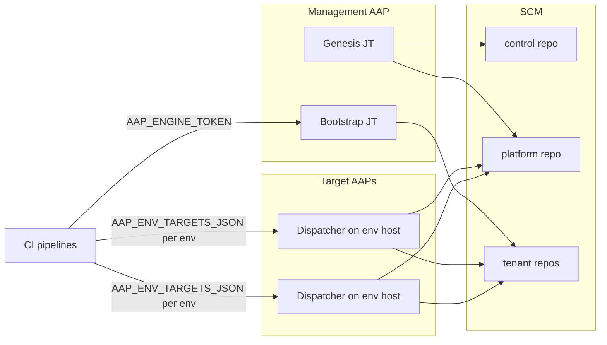

# AAP Multi-Tenant CasC Engine — Setup and Operations Guide

Canonical guide for installing, configuring, validating, and operating the
engine. Progressive disclosure:

| Part | Use when |
|---|---|
| **A** | Shortest supported setup (topology, AAP construction, secrets, first run) |
| **B** | Field-level configuration reference |
| **C** | Adoption, security, day-2 recovery |
| **D** | Validation status, limitations, troubleshooting |

OIDC federation and external secret managers are out of scope. The baseline uses
provider-native protected secrets/variables and AAP Job Template credentials.

Satellite documents (linked, not duplicated):

- [Pipeline Trigger Logic](pipeline-trigger-logic.md)
- [Nonproduction Validation](NONPRODUCTION_VALIDATION.md)
- [Resource Deletion Capabilities](resource-deletion-capabilities.md)

### Validation status

| Provider / path | Status |
|---|---|
| GitHub Actions + AAP (combined-only contract) | Live-validated for the current engine contract |
| GitLab CI | **Static / template parity only** — do not treat as live-validated |

### Security baseline

Production launcher identities must have **Execute only** on the intended Job
Template (Bootstrap-only and Dispatcher-only). Unrelated Job Template launch
must return HTTP 403. Superuser or broad Organization Admin launchers are not
production guidance.

### Prerequisites (tested baseline)

Label: **current installation prerequisite / tested baseline**, not a formal
support matrix. The formal compatibility and upgrade contract remains
**ROADMAP-008**.

| Prerequisite | Baseline |
|---|---|
| Collection | `infra.aap_configuration >=4.0.0,<5.0.0` ([`collections/requirements.yml`](../collections/requirements.yml)) |
| Execution environment | EE that can install that collection (and its certified transitive deps from Automation Hub) |
| AAP API | Management AAP for Genesis/Bootstrap; each target AAP listed in `AAP_ENV_TARGETS_JSON` for Dispatcher |
| SCM API | GitHub or GitLab token suitable for the chosen Genesis/Bootstrap `repo_mode` |
| Pipelines | Protected secrets/variables per caller role (Part A secrets) |

---

## Part A — Shortest supported setup

### A0. Multi-AAP deployment topology

CI resolves each `env_branch_map` key against `AAP_ENV_TARGETS_JSON` and launches
the Dispatcher Job Template **on that environment’s AAP host**. Do not assume a
single AAP host holds every Job Template for every environment.

| Location | Required resources |
|---|---|
| **Management / engine AAP** | Engine Project; Genesis JT; Bootstrap JT; SCM **write** credential (injects `SCM_TOKEN`); Bootstrap-only execute launcher identity + token (`AAP_ENGINE_TOKEN`); inventory/EE for those JTs |
| **Each target AAP** (every host in `AAP_ENV_TARGETS_JSON`) | Engine (or Dispatcher) Project; Dispatcher JT; SCM **read** credential (`SCM_TOKEN`); target AAP connection credential (`CONTROLLER_*`); Dispatcher-only execute launcher token for that host; inventory/EE for the JT |
| **Drift** | AAP JT only — **not** CI-launched. See placements below |



#### Drift placements (supported vs validated)

Drift is never launched by the validate/bootstrap/trigger/fanout pipelines.
Operators schedule or launch `drift-detect.yml` from AAP.

| Placement | Meaning | Status |
|---|---|---|
| **A — Management AAP** | Drift JT on management/engine AAP; attached `CONTROLLER_*` credential targets the Controller API under comparison for that run; SCM read reaches control + desired state | **Supported** by the playbook env contract |
| **B — Target AAP** | Drift JT on the target AAP; local AAP connection + SCM read | **Supported** by the playbook env contract |

Neither placement is documented here as a separately validated multi-AAP
“recommended architecture.” Choose a placement where the attached credentials
satisfy the Drift env contract for the environment under comparison. Validated
nonproduction coverage for Drift is report-mode behavior and deletion-safety
interaction (see [Nonproduction Validation](NONPRODUCTION_VALIDATION.md)), not
a mandated host topology.

### A1. Canonical AAP resource construction

Names below are **defaults**. Persist customer names in control `config.yml`
`job_templates.*` and matching Genesis `*_JT_NAME` inputs.

#### Project

| Setting | Guidance |
|---|---|
| SCM URL | Customer fork or copy of `aap-casc-engine` |
| Branch | Branch operators sync for JT playbooks |
| SCM credential | Built-in Source Control credential for **project sync only** (not the CasC `SCM_TOKEN` injector) |
| Update on launch | Recommended so JT runs use the intended engine revision |
| Galaxy / collections | EE or org Galaxy credentials must resolve `infra.aap_configuration` per prerequisites |

#### Execution environment

Use an EE that provides Ansible and can install
`infra.aap_configuration >=4.0.0,<5.0.0`. Attach that EE to Genesis, Bootstrap,
Dispatcher, and Drift Job Templates.

#### Credential types and injectors

Playbooks read **environment variables** via `lookup('env', ...)`. Configure AAP
credentials so those vars are injected at job runtime. Engine seed templates do
**not** ship the production injector schemas; operators create them on AAP.

| Credential role | Typical type | Injected env (playbook contract) | Attach to |
|---|---|---|---|
| CasC SCM token | Custom type (example name: CasC SCM Token) with `env` injector | `SCM_TOKEN` (required). Optionally also set `SCM_BASE_URL` / `SCM_PROVIDER` via fixed JT vars if not injected | Genesis, Bootstrap (write); Dispatcher, Drift (read) |
| Target AAP connection (Dispatcher) | Built-in **Red Hat Ansible Automation Platform**, or custom injectors matching the contract | `CONTROLLER_HOST`, `CONTROLLER_USERNAME`, `CONTROLLER_PASSWORD`, `CONTROLLER_VERIFY_SSL` | Dispatcher JT on **that** target host |
| Target AAP connection (Drift) | Same family | Same as Dispatcher, plus optional `CONTROLLER_OAUTH_TOKEN` (preferred when set; otherwise username/password) | Drift JT |
| Project Source Control | Built-in Source Control | Used by AAP project sync only — **not** read by CasC playbooks as `SCM_TOKEN` | Engine Project |

Built-in GitHub/GitLab PAT credential types are for Project SCM auth and do not
satisfy the CasC `SCM_TOKEN` env contract. Use a custom type with an `env`
injector for `SCM_TOKEN`.

**Dispatcher note:** `site.yml` uses username/password env vars only (not
`CONTROLLER_OAUTH_TOKEN`). **Drift** prefers `CONTROLLER_OAUTH_TOKEN` when
present.

Default example credential names used in some deployments
(`crd-platform-scm_token`, `crd-platform-aap_connection`) are conventions, not
engine requirements.

#### Job Templates

| JT (default name) | Playbook | `allow_simultaneous` | Credentials | Fixed JT vars (trust boundary) | Launch / survey inputs |
|---|---|---|---|---|---|
| `jt-platform-genesis` | `genesis.yml` | n/a | SCM write (`SCM_TOKEN`) | Optional defaults: `SCM_BASE_URL`, provider, JT name overrides | Platform/control coords, `platform_repo`, `repo_mode`, `env_branch_map`, visibility, GitLab namespace IDs, fan-out flag |
| `jt-platform-bootstrap_tenant` | `bootstrap.yml` | n/a | SCM write (`SCM_TOKEN`) | **Must bind** `CONTROL_SCM_ORG`, `CONTROL_REPO`, `CONTROL_BRANCH`, `PLATFORM_SCM_ORG`, `ENGINE_REPO`, SCM URL/provider as needed | Survey/launch: tenant fields; CI supplies `CONTROL_REVISION` + `TENANT_ID` |
| `jt-platform-casc_dispatcher` | `site.yml` | **`false` (required)** | SCM read + AAP connection | **Must bind** control coordinates + SCM URL as needed | `TARGET_ENV`, `DISPATCH_SCOPE`, `TENANT_ID` / `TRIGGERED_REPO`, `CONTROL_REVISION`, `TRIGGER_SOURCE` (CI sets these) |
| `jt-platform-drift_detection` | `drift-detect.yml` | operator choice | SCM read + AAP connection | Control coordinates + SCM URL as needed | `TARGET_ENV`, `DRIFT_MODE`, optional `CONTROL_REVISION` |

#### Trust boundary — not promptable

Do **not** make these survey/prompt fields on Bootstrap, Dispatcher, or Drift:

- `control_scm_org` / `CONTROL_SCM_ORG`
- `control_repo` / `CONTROL_REPO`
- `control_branch` / `CONTROL_BRANCH`
- Related control redirects that would let a caller retarget the control plane

CI may supply tenant fields and a pinned `control_revision` for the **bound**
control repo. One JT set serves one control plane. Parallel control planes need
separate JT sets (or a deliberate operator retarget of fixed vars).

#### Launcher identities (mandatory)

| Identity | Permission | Used as |
|---|---|---|
| Bootstrap launcher | Execute **only** on Bootstrap JT | `AAP_ENGINE_TOKEN` (control pipelines) |
| Dispatcher launcher (per target host) | Execute **only** on Dispatcher JT on that host | Token inside `AAP_ENV_TARGETS_JSON` for that env |

Verification checklist:

1. Bootstrap token launches Bootstrap → success.
2. Same token launches an unrelated JT → **403**.
3. Dispatcher token for env `dev` launches Dispatcher on the `dev` host → success.
4. Same token launches Genesis/Bootstrap or another host’s JT → **403**.
5. Missing Execute → launch fails; CI polling reports failure (including
   `poll_timeout_minutes` expiry).

### A2. SCM topology (combined-only)

| Repository class | Contents | Config |
|---|---|---|
| Engine | Playbooks, helpers, schemas, templates, reusable pipelines | SCM URL on AAP Project |
| Control | `config.yml`, `tenants.yml`, optional `naming-rules.yml` | `control_*` in Genesis / `config.yml` |
| Platform desired state | Global/shared AAP YAML | Scalar `platform_repo` (default `casc-platform-global`) |
| Tenant desired state | One tenant’s AAP YAML | Scalar `repo_name` or default `casc-tenant-<tenant_id>` |

Do not use per-resource topology. Those legacy fields are rejected:
`repo_pattern`, `repo_names`, `platform_repo_pattern`, `platform_repo_names`,
`platform_repos`.

### A3. Secrets — AAP credentials vs SCM pipeline secrets

Keep privileged SCM write and AAP apply credentials **in AAP**. Pipelines receive
execute-level launcher tokens only.

#### A3.1 AAP-managed credentials

| Secret material | Where | Rotation |
|---|---|---|
| SCM PAT/token for Genesis/Bootstrap write | CasC SCM Token credential on management AAP | Rotate in SCM IdP → update AAP credential → verify Genesis/Bootstrap dry launch |
| SCM PAT/token for Dispatcher/Drift read | Same type on each target (and Drift host) | Rotate → update each host’s credential → verify Dispatcher clone |
| Controller username/password or OAuth for apply/compare | AAP connection credential on Dispatcher/Drift | Rotate service account → update credential → launch Dispatcher/Drift |
| Project sync Source Control password/PAT | Project SCM credential | Rotate → project sync |

Never commit tokens into desired-state YAML or JT extra vars.

#### A3.2 SCM pipeline secrets (GitHub Actions)

| Name | Kind | Caller roles | Purpose | Minimum privilege |
|---|---|---|---|---|
| `CONTROL_REPO_TOKEN` | secret | control, platform, tenant | Read control `config.yml` / `tenants.yml` / lifecycle markers | Read access to control repo |
| `ENGINE_REPO_TOKEN` | secret | control, platform, tenant | Checkout private engine helpers/schemas when required | Read access to engine repo |
| `AAP_ENV_TARGETS_JSON` | secret | control, platform, tenant | Per-env Dispatcher launch (`host` + `token` only) | Dispatcher Execute on each listed host |
| `AAP_ENGINE_TOKEN` | secret | **control only** | Launch Bootstrap JT | Bootstrap Execute only |
| `AAP_ENGINE_HOST` | **variable** | **control only** | Management AAP API base URL for Bootstrap | n/a (non-secret URL) |

`AAP_ENV_TARGETS_JSON` format (token-only; username/password rejected):

```json
{
  "dev": {"host": "https://aap-dev.example", "token": "..."},
  "prd": {"host": "https://aap-prd.example", "token": "..."}
}
```

Keys must match `env_branch_map` environment names used at runtime.

| Pipeline job | Secrets used |
|---|---|
| `validate` (push/PR) | `ENGINE_REPO_TOKEN`, `CONTROL_REPO_TOKEN` — **no** deploy secrets |
| `bootstrap` | `ENGINE_REPO_TOKEN`, `CONTROL_REPO_TOKEN`, `AAP_ENGINE_TOKEN` + `aap_engine_host` |
| `fanout` / `trigger` / `onboarding_dispatch` | `CONTROL_REPO_TOKEN`, `AAP_ENV_TARGETS_JSON` |

Configure secrets as protected/masked where the provider allows. Scope deploy
secrets away from pull-request contexts. Fork PRs and environments without
`CONTROL_REPO_TOKEN` fail closed on validate steps that need control metadata;
deploy jobs must not run without deploy secrets.

Cross-organization reusable workflows do **not** inherit org secrets automatically;
callers must pass secrets explicitly (seeded callers do this).

Do **not** use public-repository org-secret workarounds as production guidance.

#### A3.3 SCM pipeline variables (GitLab — static parity)

Use protected/masked CI/CD variables with the **same names**. Privilege split is
by where variables are defined (group/project/environment) and
`CASC_CALLER_ROLE`, not by divergent caller YAML. Live GitLab validation is
deferred; treat this as template parity with the GitHub-proven contract.

GitLab create-mode also needs numeric namespace IDs
(`PLATFORM_NAMESPACE_ID` / `CONTROL_NAMESPACE_ID` / tenant namespace ID).

#### A3.4 Token rotation (pipeline)

1. Create replacement tokens with the same least-privilege scope.
2. Update the secret/variable in each org/group that holds it.
3. Run validate-only on a feature branch (no deploy).
4. Run a controlled mapped-branch or Bootstrap path in nonproduction.
5. Revoke the old token after success.

### A4. Run Genesis

**Step card**

1. Confirm management AAP Project syncs the intended engine revision.
2. Confirm Genesis JT has SCM write credential injecting `SCM_TOKEN`.
3. Launch with customer inputs (example):

```yaml
scm_base_url: https://github.com
platform_scm_org: ww-platform
control_scm_org: ww-platform
control_repo: casc-platform-control
control_branch: main
platform_repo: casc-platform-global
repo_mode: existing
repo_visibility: private
env_branch_map:
  dev: develop
  tst: release/tst
  prd: main
```

4. Verify control repo contains `config.yml`, `tenants.yml`, and
   `naming-rules.yml.sample` on `control_branch`.
5. Verify platform repo has callers and folder scaffold on mapped branches.

Notes:

- `repo_mode` is launch-time only (not written to `config.yml`).
- `repo_mode=existing` preserves unrelated files; engine converges managed
  scaffold. Empty pre-created repos are allowed when
  `create_missing_env_branches=true`.
- Genesis does not activate naming policy by default.

### A5. Bootstrap one tenant

**Recommended survey schema**

| Field | Survey required? | Runtime rule |
|---|---:|---|
| `tenant_id` | Yes | `^[a-z][a-z0-9_]*$`, max 64 |
| `onboarding_mode` | Yes | `greenfield` or `brownfield` |
| `aap_organization` | No | Greenfield defaults to `tenant_id`; Brownfield requires it |
| `team_name` | No | Greenfield requires it; Brownfield rejects it |
| `tenant_scm_org` | Yes if unregistered | Registered Git record is authoritative |
| `repo_mode`, `repo_visibility` | No | Defaults apply when omitted |
| `repo_name` | No | Optional combined tenant repository override |
| `tenant_scm_namespace_id` | No | GitLab create mode when needed |

Do not configure team-lead, user-password, or individual SCM collaborator survey
questions.

**Greenfield registry example**

```yaml
---
tenants:
  - tenant_id: stores
    aap_organization: WW Stores Automation
    team_name: Stores Automation
    tenant_scm_org: ww-tenants
    repo_name: stores-aap-casc
    repo_mode: existing
    onboarding_mode: greenfield
    status: active
```

**Step card (GitOps)**

1. Commit the tenant record to control `tenants.yml` and push `control_branch`.
2. Control pipeline validates, diffs `tenants.yml`, launches Bootstrap with
   `tenant_id` + pinned `control_revision`.
3. Conflicting survey values vs Git fail closed (Git wins for registered tenants).
4. Greenfield Bootstrap writes Organization + Team foundation on every mapped
   platform branch and scaffolds every mapped tenant branch. It does **not**
   create users, RBAC, Galaxy associations, EE associations, or SCM memberships.
5. If `bootstrap_dispatch_fanout=true`, onboarding dispatches platform scope
   then only the new tenant per environment (never `full`). If false, complete
   via protected control `onboarding_dispatch`.
6. If `dispatch_enabled=false`, scaffolding and foundation still run; tenant
   apply waits until re-enabled.

### A6. First dispatch

After Bootstrap (or for day-2 desired state):

1. Merge validated YAML to the lowest mapped branch in the relevant platform or
   tenant repo.
2. Pipeline `trigger` launches Dispatcher on the mapped env host via
   `AAP_ENV_TARGETS_JSON`.
3. Confirm Dispatcher `allow_simultaneous=false` and job succeeds.
4. Promote low → high through mapped branches.

Manual local example:

```bash
ansible-playbook site.yml \
  -e target_env=dev \
  -e dispatch_scope=tenant \
  -e tenant_id=stores
```

(Requires `CONTROLLER_*` and `SCM_*` in the environment.)

---

## Part B — Configuration reference

Source tags used below:

| Tag | Meaning |
|---|---|
| `cred` | Credential injection (`lookup('env', ...)`) |
| `fixed` | Fixed JT extra var / env bound on the JT |
| `survey` | Survey or ad-hoc launch extra var |
| `control` | Persisted in control `config.yml` |
| `tenant` | Persisted in control `tenants.yml` |
| `pipeline` | Supplied by CI workflow/job |

### B1. Genesis inputs

| Input | Source | Default | Meaning |
|---|---|---|---|
| `SCM_TOKEN` | `cred` | required | SCM API + git write |
| `SCM_BASE_URL` | `cred`/`fixed`/`survey` | `https://github.com` | SCM base URL |
| `SCM_PROVIDER` | `cred`/`fixed`/`survey` | auto from URL | `github` \| `gitlab` |
| `PLATFORM_SCM_ORG` | `fixed`/`survey` | required | Platform namespace |
| `CONTROL_SCM_ORG` | `fixed`/`survey` | platform org | Control namespace |
| `CONTROL_REPO` | `fixed`/`survey` | `casc-platform-control` | Control repo name |
| `CONTROL_BRANCH` | `fixed`/`survey` | `main` | Control branch |
| `ENGINE_REPO` | `fixed`/`survey` | `aap-casc-engine` | Engine repo name (caller wiring) |
| `PLATFORM_REPO` | `fixed`/`survey` | `casc-platform-global` | Combined platform repo |
| `REPO_MODE` | `survey` | `create` | Launch-time only; not in `config.yml` |
| `REPO_VISIBILITY` | `survey` | `private` | `private` \| `public` |
| `CREATE_MISSING_ENV_BRANCHES` | `fixed`/`survey` | `true` | Create missing mapped branches |
| `BOOTSTRAP_DISPATCH_FANOUT` | `fixed`/`survey` | `true` | Persisted to `config.yml` |
| `env_branch_map` | `survey`/`fixed` | see playbook | Ordered low→high map |
| `GENESIS_JT_NAME` / `BOOTSTRAP_JT_NAME` / `DISPATCHER_JT_NAME` / `DRIFT_DETECTION_JT_NAME` | `fixed`/`survey` | documented defaults | Seeded into `job_templates.*` |
| `PLATFORM_NAMESPACE_ID` / `CONTROL_NAMESPACE_ID` | `survey` | — | GitLab create mode |
| `AAP_ENGINE_HOST` | `fixed`/`survey` | optional | Seeded into control caller wiring |

Legacy topology inputs are rejected: `platform_repo_pattern`,
`platform_repo_names`, `repo_pattern`, `repo_names`, and matching `*_JSON`
env vars.

### B2. Control `config.yml`

| Field | Source | Notes |
|---|---|---|
| `scm_provider` | `control` (seeded) | `github` \| `gitlab` |
| `control_scm_org`, `control_repo`, `control_branch` | `control` | Bound into JT fixed vars in operations |
| `platform_scm_org`, `platform_repo` | `control` | Combined platform scalar |
| `create_missing_env_branches` | `control` | Boolean |
| `bootstrap_dispatch_fanout` | `control` | Boolean |
| `dispatcher_concurrency` | `control` | Seeded `serialized` |
| `job_templates.*` | `control` | Customer JT names |
| `env_branch_map` | `control` | Must align with `AAP_ENV_TARGETS_JSON` keys used in CI |

Example:

```yaml
---
scm_provider: github
control_scm_org: ww-platform
control_repo: casc-platform-control
control_branch: main
platform_scm_org: ww-platform
platform_repo: casc-platform-global
create_missing_env_branches: true
bootstrap_dispatch_fanout: true
dispatcher_concurrency: serialized
job_templates:
  genesis: jt-platform-genesis
  bootstrap: jt-platform-bootstrap_tenant
  dispatcher: jt-platform-casc_dispatcher
  drift_detection: jt-platform-drift_detection
env_branch_map:
  dev: develop
  tst: release/tst
  prd: main
```

### B3. Tenant record (`tenants.yml`)

| Field | Source | Greenfield | Brownfield | Notes |
|---|---|---|---|---|
| `tenant_id` | `tenant` | required | required | Stable engine key |
| `aap_organization` | `tenant` | optional | required | Exact AAP Organization name |
| `team_name` | `tenant` | required | forbidden | Greenfield Team only |
| `tenant_scm_org` | `tenant` | required | required | Tenant SCM org/group |
| `tenant_scm_namespace_id` | `tenant` | GitLab when needed | GitLab when needed | Numeric ID |
| `repo_name` | `tenant` | optional | optional | Combined repo override |
| `repo_mode` | `tenant` | optional | optional | Persisted for Bootstrap |
| `repo_visibility` | `tenant` | optional | optional | Default `private` |
| `onboarding_mode` | `tenant` | required | required | `greenfield` \| `brownfield` |
| `status` | `tenant` | optional | optional | `active` \| `inactive` |
| `dispatch_enabled` | `tenant` | optional | optional | Default `true` |

Do not store derived `repository` / `repositories` / `repo_by_folder` as
customer inputs. Legacy `repo_pattern` / `repo_names` are rejected.

### B4. Bootstrap launch inputs

| Input | Source | Notes |
|---|---|---|
| `SCM_TOKEN`, `SCM_*` | `cred`/`fixed` | Same pattern as Genesis |
| Control coordinates | `fixed` | Trust boundary |
| `CONTROL_REVISION` | `pipeline` / launch | Pin; mismatch fails closed |
| `TENANT_ID`, `ONBOARDING_MODE`, … | `survey` / `pipeline` | CI uses `tenant_id` + revision for registered tenants |
| GitLab namespace helpers | `survey`/`fixed` | Create mode |

### B5. Branch and pipeline model

| User action | Result |
|---|---|
| Push to mapped desired-state branch | Validate + dispatch caller scope to mapped env |
| Push to feature branch | Validate only |
| Pull/merge request | Validate only; no deploy credentials |
| Control push changing `tenants.yml` | Validate, lifecycle diff, Bootstrap, bounded fan-out when enabled |
| Protected `onboarding_dispatch` | Resume one pending Greenfield tenant |
| `[skip dispatch]` commit | Validation only |

See [Pipeline Trigger Logic](pipeline-trigger-logic.md).

### B6. Dispatcher inputs (`site.yml`)

| Input | Source | Default / rule |
|---|---|---|
| `CONTROLLER_HOST` / `CONTROLLER_USERNAME` / `CONTROLLER_PASSWORD` / `CONTROLLER_VERIFY_SSL` | `cred` | Required for apply |
| `SCM_TOKEN`, `SCM_BASE_URL` | `cred`/`fixed` | Clone control + desired state |
| Control coordinates | `fixed` | Trust boundary |
| `TARGET_ENV` | `pipeline` / launch | Required |
| `DISPATCH_SCOPE` | `pipeline` / launch | `full` if `TRIGGER_SOURCE` ∈ `{scheduled,drift}`; else typically `tenant`/`platform` from CI |
| `TENANT_ID` / `TRIGGERED_REPO` | `pipeline` / launch | Scope selection |
| `CONTROL_REVISION` | `pipeline` / launch | Pin when supplied |
| `TRIGGER_SOURCE` | `pipeline` / launch | Default `scheduled` |
| `TRIGGER_COMMIT` | `pipeline` | Optional metadata |

Normal platform/tenant pipelines never request `full`.

### B7. Drift inputs (`drift-detect.yml`)

| Input | Source | Default / rule |
|---|---|---|
| `CONTROLLER_*` (+ optional `CONTROLLER_OAUTH_TOKEN`) | `cred` | OAuth preferred when set |
| `SCM_*` + control coordinates | `cred`/`fixed` | Desired-state snapshot |
| `TARGET_ENV` | launch | Required |
| `DRIFT_MODE` | launch | `report` \| `remediate` |
| `DRIFT_REPORT_PATH` | launch | `/tmp/drift-report.json` |
| `CONTROL_REVISION` | launch | Optional pin |

Current comparison coverage: Organizations, credential types, projects, and
job templates. Undeclared live objects may appear as `extra_in_live`.

---

## Part C — Adoption, security, and day-2 recovery

### C1. Brownfield gradual adoption

1. Register exact existing `aap_organization` with no `team_name`.
2. Bootstrap SCM only (no AAP foundation, no onboarding fan-out).
3. Baseline one object into YAML on a feature branch; open PR/MR.
4. Merge to the lowest mapped branch; promote upward.
5. Repeat object by object.

Absence from YAML is never deletion. Use Drift **report** mode before any
remediation during adoption.

### C2. Optional naming policy

Active path: control-root `naming-rules.yml` at the pinned control revision.

| File state | Behavior |
|---|---|
| Missing or empty | Naming inactive |
| Contains resource rules | Enforce only those types |

Day-0: start from Genesis-seeded `naming-rules.yml.sample` on `control_branch`,
rename to `naming-rules.yml`, adapt, uncomment. Policy never renames objects and
never validates filenames.

### C3. Scaffold lifecycle (combined-only)

First matching `.aap-casc-engine/tenant-scaffold.yml` is the lifecycle boundary.

| Field group | Before any marker | After any marker |
|---|---|---|
| `tenant_id` | May correct or remove | Immutable |
| Effective `aap_organization` | May correct | Immutable |
| SCM namespace, `repo_mode`, `repo_name` / resolved `repository`, onboarding mode, visibility | May correct | Immutable |
| Greenfield `team_name` | May correct | Immutable Bootstrap input |
| `status`, `dispatch_enabled` | Mutable | Mutable |

Exact marker-owned identity may be **restored** (no force-push). Changes **away**
from marker-owned identity are rejected. Lifecycle enforcement applies on GitHub
PR validate (and GitLab MR validate templates) when `CONTROL_REPO_TOKEN` can
read markers.

### C4. Repository permissions and branch protection

Bootstrap does not manage individual SCM collaborators.

Recommendations:

- Protect `control_branch` and every mapped environment branch.
- Require PR/MR review before merge to protected branches.
- Restrict who can push secrets or change launcher tokens.
- `repo_mode=create` needs namespace create permission; `existing` preserves ACLs.

### C5. Users, RBAC, credentials, and execution environments

Generic Bootstrap creates no users and assigns no roles. Declare users, IdP
mappings, RBAC, Galaxy credentials, and EE associations in desired-state YAML.
Shipped user examples contain no password; apply paths disable the collection
`change_me` fallback.

### C6. Deletion and drift limits

Absence from YAML is never deletion. Unsupported `state: absent` fails CI
validate-deletions and Dispatcher before apply. See
[Resource Deletion Capabilities](resource-deletion-capabilities.md).

### C7. Day-2 recovery runbooks

#### Safe Genesis / Bootstrap reruns

Idempotent for unchanged topology. Rerun Genesis to reconverge managed scaffold.
Rerun Bootstrap for a registered tenant with matching marker-owned identity.

#### Partial scaffolding recovery

Inspect markers and foundation paths. Re-run Bootstrap with the same registry
identity. Do not edit marker identity fields by hand to “force” a rename.

#### Marker conflict

Symptom: validate/Bootstrap rejects identity/topology change after scaffolding.
Action: restore the exact marker-owned registry values (Git revert of the bad
registry change) and re-push. Do not force-push markers or rewrite history to
hide the conflict.

#### Exact marker-owned restoration

Allowed: return `tenants.yml` (and related fields) to the exact values owned by
the marker. Rejected: any change away from those values after the marker exists.

#### `status: inactive` and `dispatch_enabled`

- `inactive`: retains reservation of tenant ID, org, and repo ownership; skips
  normal dispatch participation per engine rules.
- `dispatch_enabled=false`: Greenfield still scaffolds + foundation; tenant
  desired-state apply waits until re-enabled, then use mapped-branch merge or
  protected manual dispatch.

#### `bootstrap_dispatch_fanout=false`

Complete pending Greenfield onboarding with protected control
`onboarding_dispatch` for that `tenant_id` (requires control secrets).

#### Control revision mismatch

CI pins `control_revision`. If Bootstrap/Dispatcher sees a different control
HEAD than expected, fail closed. Re-run from a fresh control push or supply the
correct pin; do not bypass the pin in caller workflows.

#### Missing branches

Enable `create_missing_env_branches` or pre-create every mapped branch. Callers
must exist on every mapped branch.

#### Token rotation

Follow A3.1 / A3.4. After rotation, confirm validate + one nonprod dispatch.

#### Customer JT renaming

1. Rename JTs in AAP.
2. Update `job_templates.*` in `config.yml`.
3. Rerun Genesis (or update seeded names) with matching `*_JT_NAME` inputs.
4. Confirm CI launches resolve the new names on each host.

#### Failed or timed-out Dispatcher jobs

Check: JT exists on **that env’s host**, `allow_simultaneous=false`, launcher
RBAC, token in `AAP_ENV_TARGETS_JSON`, SCM read, Controller credential, and CI
poll timeout. Fix root cause; re-push or re-launch with the same
`control_revision` as needed.

#### Safe rollback (no force-push)

1. Revert the undesired Git commit(s) on the mapped branch via PR/MR.
2. Merge the revert so CI validates and redispatches.
3. Never force-push control history or scaffold markers to “undo” lifecycle.
4. For AAP object rollback, prefer desired-state revert + Dispatcher over ClickOps
   when the object is already CasC-managed.

### C8. Launcher RBAC procedure

1. Create dedicated users/tokens for Bootstrap and per-env Dispatcher.
2. Grant Execute only on the intended JT.
3. Prove unrelated JT → 403.
4. Store tokens only in AAP credentials (apply path) or protected CI secrets
   (launch path) as designed in A3.
5. Document owners and rotation cadence.

---

## Part D — Validation and troubleshooting

### D1. Local checks

```bash
python3 -m unittest tests/test_topology_contract.py
ansible-playbook --syntax-check genesis.yml
ansible-playbook --syntax-check bootstrap.yml
python3 -m py_compile scripts/pipeline/*.py schemas/validate_naming.py
```

`site.yml` and Drift syntax checks require `infra.aap_configuration` in the
local collection path.

### D2. Nonproduction evidence status

| Area | Status |
|---|---|
| GitHub combined-only path, lifecycle, deletion safety, launcher least-privilege | Covered by the current nonproduction validation program |
| GitLab live matrix | **Deferred** — static template parity only |
| Formal support/upgrade matrix | **ROADMAP-008** (not this guide) |

Run scenarios in [Nonproduction Validation](NONPRODUCTION_VALIDATION.md). Archive
evidence **outside** this engine repository.

### D3. Troubleshooting by symptom

| Symptom | Likely cause | Action |
|---|---|---|
| Tenant ID rejected | Unsafe key | Use `^[a-z][a-z0-9_]*$`, max 64 |
| Brownfield rejected | Org/team rules | Require `aap_organization`; omit `team_name` |
| Marker conflict / immutable lifecycle | Post-scaffold identity change | Restore marker-owned values; no force-push |
| Naming failure | Active `naming-rules.yml` | Align exact Organization/Team strings |
| Missing branch | Branch map gap | Create branches or enable creation |
| Missing `CONTROL_REPO_TOKEN` | Secret not injected (fork/PR/private plan) | Provide read token to validate job; do not expose deploy secrets to PRs |
| JT not found on target host | Dispatcher missing on that AAP | Install Project+JT+creds on every `AAP_ENV_TARGETS_JSON` host |
| Dispatch timeout | Job pending/failed or poll window | Check AAP job, RBAC, token, `poll_timeout_minutes` |
| `allow_simultaneous` failure | Dispatcher concurrency | Set Dispatcher `allow_simultaneous=false` |
| `state: absent` / deletion | Unsupported | Remove declaration; see deletion matrix |
| Username/password in `AAP_ENV_TARGETS_JSON` | Rejected contract | Token-only JSON |
| Bootstrap survey conflict | Survey ≠ Git registry | Launch with `tenant_id` + revision; fix Git |

### D4. Deferred capabilities

- GitLab live validation parity
- ROADMAP-008 formal support / upgrade matrix
- Scoped Dispatcher concurrency beyond serialized baseline
- Composite overlay identity for selected RBAC/role/input-source types
- Drift coverage redesign and unmanaged-object semantics
- Establishing any new unvalidated Drift multi-AAP baseline beyond the playbook
  env contract

These must not be presented as completed by the current release.
